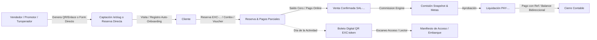
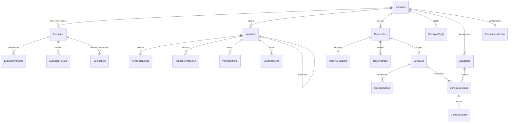
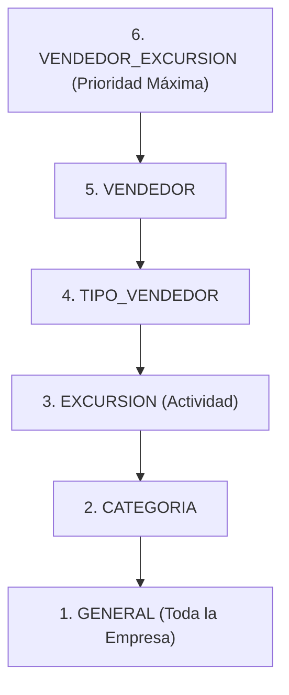
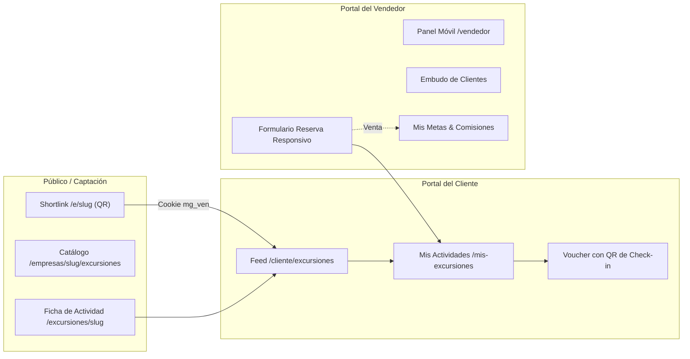

# Módulo de Parques y Tours — Documentación Técnica

Documentación técnica y operativa integral del módulo de **Parques y Tours** (*Sales, Bookings & Commission Management*) de MembeGo, diseñado para parques temáticos, atracciones turísticas, operadores de tours, agencias y empresas de experiencias y pases de día.

---

## 1. Resumen Ejecutivo y Cadena de Valor

El módulo de **Parques y Tours** administra el ciclo de vida comercial, financiero y operativo de las empresas de atracciones y actividades dentro del ecosistema multi-tenant de MembeGo. Cubre desde la captación omnicanal (QR, WhatsApp, enlaces) y paquetes combinados, hasta la liquidación a promotores/turoperadores, el registro de logística de hotel y el embarque o acceso de pasajeros en taquilla, muelle o transporte mediante boletos QR.

### Cadena de Valor Auditada



```
Empresa → Vendedor/Turoperador → Enlace/QR/Form → Cliente/Agencia → Auto-Onboarding → Reserva/Combo → Pagos → Venta → Comisión (Snapshot + Metas) → Liquidación → Check-in QR
```

---

## 2. Principios Arquitectónicos y Convenciones

1. **Aislamiento Multi-Tenant Estricto**: Todas las operaciones y lecturas se ejecutan mediante `conEmpresa(companyId, tx => ...)` y respetan los contextos de tenant. No existen fugas cruzadas de identificadores, clientes ni reportes.
2. **Desacoplamiento del Núcleo (Flat IDs)**:
   - Dentro del dominio de parques y tours existen relaciones Prisma completas (`@relation`).
   - Hacia entidades del núcleo (`Company`, `Cliente`, `User`, `Sucursal`, `Campana`), se almacenan identificadores planos (`companyId`, `clienteId`, `userId`, `sucursalId`) para preservar la modularidad fundacional sin acoplar el esquema central.
3. **Lógica de Negocio en Núcleos Puros (`nucleo.ts`)**:
   - Cada subdominio (`catalogo`, `vendedores`, `atribucion`, `reservas`, `ventas`, `comisiones`, `liquidaciones`, `checkin`, `metricas`, `reportes`) separa sus reglas matemáticas, validaciones y máquinas de estado en funciones puras sin dependencias de Prisma ni red.
   - 100% deterministas y cubiertas por pruebas unitarias automatizadas (`tests/excursiones-*.test.ts`).
4. **Inmutabilidad y Trazabilidad Contable**:
   - **Los precios provienen del servidor**: El navegador nunca envía montos; el backend consulta el catálogo y congela precios e impuestos en la reserva.
   - **Nada se borra**: Los pagos se anulan mediante contra-asientos registrados; las reservas y ventas se cancelan preservando auditoría.
   - **Comisiones con Snapshot**: La comisión guarda una fotografía inmutable de la regla (`reglaSnapshot`) y una explicación legible (`desglose`). Modificar reglas a futuro no altera comisiones históricas.
   - **Comisiones pagadas no se anulan**: Se corrigen mediante `ComisionAjuste` con signo (+/−).
   - **Sin comisionar impuestos**: La base comisionable es el monto neto recibido por la empresa excluyendo el ITBIS/impuestos estatales.
5. **Manejo de Zona Horaria**:
   - Plataforma fijada en `America/Santo_Domingo` (`OFFSET_PLATAFORMA_MIN = -240`, UTC−4 todo el año sin horario de verano).
   - Los cierres de día, semanas comerciales (inicio en Lunes) y cortes mensuales operan en hora local para garantizar concordancia fiscal y operativa.
6. **Estados como String Validado**:
   - Se emplean cadenas (`'ACTIVA'`, `'PENDIENTE'`, etc.) tipadas en TypeScript en lugar de Enums de base de datos para facilitar migraciones y extensiones sin bloqueo de tablas.

---

## 3. Modelo de Datos (Prisma Schema)

El esquema se ubica en `prisma/schema/excursiones.prisma` y comprende modelos agrupados en 5 dominios:



### 3.1 Catálogo, Variantes, Paquetes Combinados (`COMBO`) y Pases de Día (`PASE_DIA`)
- **`Excursion` (Actividad)**: Nombre, slug único por empresa, portada, galería JSON, duración, punto de encuentro/salida, horas de inicio/regreso, políticas, estado (`ACTIVA`, `PAUSADA`, `AGOTADA`, `TEMPORAL`, `ARCHIVADA`), moneda (`DOP`, `USD`, `EUR`), impuesto porcentual (`impuestoPct`), capacidad y tipo de ítem (`tipoItem`: `'ACTIVIDAD'`, `'COMBO'` o `'PASE_DIA'`).
  - **`ACTIVIDAD`**: Tour o actividad con turnos u horarios de salida/inicio específicos.
  - **`PASE_DIA`**: Entrada o pase de día a parques/atracciones con acceso abierto para la fecha reservada, sin horarios rígidos, con límite de cupos diarios acumulados por fecha. Elegible como actividad independiente o dentro de paquetes `COMBO`.
  - **`COMBO`**: Paquete de múltiples actividades coordinadas en itinerario optimizado en el mismo día o multi-fecha.
- **`ExcursionVariante` (Tarifas y Variantes)**: Variantes de la actividad o pase (ej. Estándar, VIP, Familiar) con **Tarifas Diferenciadas**:
  - 🌍 **Tarifa Turistas / General**: `precioAdulto` (Adulto Turista *), `precioNino` (Niño Turista).
  - 🇩🇴 **Tarifa Residentes / Locales**: `precioResidente` (Adulto Residente), `precioNinoResidente` (Niño Residente).
  - Reglas dinámicas por día de semana y turno (`preciosDinamicos`).
- **`ExcursionHorario`**: Días de operación semanales (`diasSemana` en arreglo ISO `[1..7]`), hora de salida/inicio programada y cupo particular por turno.
- **`ComboItem`**: Elementos que componen un paquete o combo de actividades, con referencia a la actividad o pase del catálogo (`excursionHijaId`), orden de ejecución (`orden`), duración estimada y horarios sugeridos.

### 3.2 Vendedores, Turoperadores y Atribución
- **`Vendedor`**: Identidad comercial con `codigo` estable único (`RAF-00001`), `userId` opcional (solo si se le otorga acceso al panel web), teléfono (clave anti-duplicados), tipo (`TipoVendedor`: `PROMOTOR`, `REP_HOTEL`, `TOUROPERADOR`, `AGENCIA`), jerarquía (`supervisorId`) y estado (`ACTIVO`, `SUSPENDIDO`, `INACTIVO`).
- **`VendedorEnlace`**: Slugs globales aleatorios (`/e/[slug]`) vinculados al vendedor y opcionalmente a campañas (`campanaId`).
- **`VendedorAtribucion`**: Registro inmutable de eventos del embudo (`VISITA`, `REGISTRO`, `RESERVA`, `COMPRA`), canal (`QR`, `ENLACE`, `WHATSAPP`, `REDES`), cookie de visitante (`visitorId`) y cliente asociado (`clienteId`).
- **`VendedorMeta`**: Objetivos comerciales por período (`DIARIA`, `SEMANAL`, `MENSUAL`, `RANGO`) sobre ventas, pasajeros, ingresos, registros o reservas, aplicables a un vendedor individual o a todo un tipo de vendedor (`tipoVendedorId`).
- **`VendedorBono`**: Incentivos extraordinarios independientes de la comisión (`PENDIENTE`, `OTORGADO`, `PAGADO`, `ANULADA`).

### 3.3 Reservas, Desglose de Paquetes (`ReservaItem`), Logística B2B y Ventas
- **`ReservaExc`**: Correlativo `numero` (`EXC-2026-000184`), `clienteId`, `vendedorId` atribuido, fecha, hora, conteo de adultos/niños, desglose económico (`subtotal`, `descuento`, `impuestos`, `total`), token de check-in (`checkinToken`), marca de embarque/acceso (`checkinAt`), notas, datos de logística de hotel/transporte (`voucherAgencia`, `hotelRecogida`, `lobbyRecogida`, `horaRecogida`, `habitacion`) y estado (`PENDIENTE`, `CONFIRMADA`, `PARCIALMENTE_PAGADA`, `PAGADA`, `COMPLETADA`, `CANCELADA`, `NO_SHOW`).
- **`ReservaItem`**: Componentes individuales de una reserva de combo o paquete. Almacena:
  - `actividadId`: Referencia directa a la actividad o pase de día hijo.
  - `fecha` y `hora`: Fecha y turno programados para esa actividad particular (permite itinerarios en el mismo día o en días separados).
  - `adultos` y `ninos`: Cantidad de pasajeros asignados.
  - `estado` y `checkinAt`: Estado operativo independiente (`PENDIENTE`, `EMBARCADA`, `NO_SHOW`, `CANCELADA`) para permitir check-ins en días y estaciones separadas.
- **`ReservaPasajero`**: Registro individual de cada pasajero con tipo (`ADULTO`, `NINO`), nombre opcional, estado de acceso/embarque (`presente`) y marca de tiempo (`checkinAt`).
- **`ReservaPago`**: Historial de abonos con monto, moneda, método (`EFECTIVO`, `TARJETA`, `TRANSFERENCIA`, `DEPOSITO`, `LINK`), referencia externa, comprobante y estado (`REGISTRADO`, `ANULADO`).
- **`VentaExc`**: Transacción de cierre financiero `numero` (`SAL-000184`) vinculada 1 a 1 a `reservaId`, congelando la atribución del vendedor y el número de pasajeros. Estados: `CONFIRMADA`, `COMPLETADA`, `CANCELADA`, `REEMBOLSADA`.

### 3.4 Comisiones y Liquidaciones
- **`ComisionRegla`**: Reglas de comisión con ámbito (`GENERAL`, `CATEGORIA`, `EXCURSION`, `TIPO_VENDEDOR`, `VENDEDOR`, `VENDEDOR_EXCURSION`), tipo de cálculo:
  - **`PORCENTAJE`**: Porcentaje sobre la tarifa de cada pasajero / venta (Recomendado, adaptado a tarifas de adultos vs niños y turistas vs residentes).
  - **`FIJO_VENTA`**: Monto fijo por venta completada.
  - **`FIJO_ADULTO`**: Monto fijo por cada pasajero adulto.
  - **`FIJO_NINO`**: Monto fijo por cada pasajero niño.
  - **`ESCALON`**: Por tramos de volumen de pasajeros.
  - **`PAQUETE_REGALO`**: Paquete de cortesía cada N ventas.
- **`ComisionEntrada`**: Registro de comisión generado. Congela la base, el monto calculado, `reglaSnapshot` JSON, texto explicativo `desglose` y estado (`ESTIMADA`, `GENERADA`, `APROBADA`, `PENDIENTE_PAGO`, `PAGADA`, `ANULADA`).
- **`ComisionAjuste`**: Contra-asientos contables firmados con signo (+/−) vinculados a la comisión para cancelaciones o penalidades.
- **`Liquidacion`**: Agrupación de pago a un vendedor `numero` (`PAY-2026-0014`), rango de fechas, suma neta total, método, referencia bancaria y estado (`BORRADOR`, `APROBADA`, `PAGADA`, `ANULADA`).

---

## 4. Motores y Lógica de Negocio (Core Modules)

### 4.1 Catálogo y Paquetes Combinados (`src/modules/excursiones/catalogo/`)
- **Gestión de Tarifas Diferenciadas**: Formulación clara de tarifas para Turistas (Adulto/Niño) y Residentes (Adulto/Niño), con cupos límites por salida.
- **Motor de Horarios de Combos (`nucleo.ts`)**:
  - `diasComunesCombo(items)`: Calcula la intersección estricta de días de la semana en que operan todas las actividades que componen el paquete.
  - `validarItinerarioCombo(items)`: Detecta y rechaza solapamientos de horas en el mismo día considerando la hora de inicio y la duración en minutos de cada actividad.
  - `autoResolverItinerarioCombo(actividades, dia)`: Ajusta y sugiere automáticamente la secuencia óptima de horarios consecutivos sin solapamiento para paquetes de múltiples actividades en el mismo día.
  - `generarCombinacionesCombo(actividades, dias)`: Genera exhaustivamente todas las combinaciones posibles de turnos compatibles.

### 4.2 Vendedores, Turoperadores y Atribución (`src/modules/excursiones/vendedores/` y `atribucion/`)
- Generación de código comercial correlativo `codigoVendedor(prefijo, correlativo)` (ej. `ISL-00001`).
- Enlaces de captación cortos (`/e/[slug]`) con detección de bots y deduplicación por `visitorId` + `enlaceSlug` en ventana de 24h.
- Políticas de atribución: `PRIMERA` (captación original), `ULTIMA` (interacción más reciente) o `RESERVA` (vendedor que levanta la reserva).
- Jerarquía de supervisión para agencias y promotores en campo.

### 4.3 Reservas y Logística B2B (`src/modules/excursiones/reservas/`)
- **Auto-Onboarding**: Al crear una reserva (desde el panel del vendedor o enlace público), si el cliente no está registrado previamente en la empresa, el sistema genera automáticamente su cuenta de cliente y su pase digital.
- **Logística de Hotel y Transporte**: Soporte integrado para voucher externo de turoperador, hotel/resort de hospedaje, lobby de encuentro, hora de recogida y número de habitación.
- **Cálculo de Totales (`calcularTotales`)**:
  $$\text{Subtotal} = (\text{Adultos} \times \text{PrecioAdulto}) + (\text{Niños} \times \text{PrecioNiño})$$
  $$\text{Base Imponible} = \max(0, \text{Subtotal} - \text{Descuento})$$
  $$\text{Impuestos} = \text{Base Imponible} \times \left(\frac{\text{ImpuestoPct}}{100}\right)$$
  $$\text{Total} = \text{Base Imponible} + \text{Impuestos}$$
- **Máquina de Estados por Abonos**: `PENDIENTE` $\to$ `PARCIALMENTE_PAGADA` $\to$ `PAGADA`.
- **Venta Automática e Idempotente**: Al saldar el 100% de la reserva, se dispara la venta (`SAL-XXXXXX`) y se genera el snapshot de comisión.

### 4.4 Motor de Comisiones y Jerarquía de Reglas (`src/modules/excursiones/comisiones/`)
Jerarquía de especificidad estricta para asignación de reglas de comisión:



- Soporta: `PORCENTAJE` (sobre tarifa por pasajero / venta), `FIJO_VENTA`, `FIJO_ADULTO`, `FIJO_NINO`, `ESCALON` y `PAQUETE_REGALO`.
- **Tope a la Base**: Si la comisión calculada excede el neto comisionable, se ajusta automáticamente al tope de la base sin crear deudas ficticias.

### 4.5 Metas de Ventas y Reportes (`src/modules/excursiones/metricas/` y `reportes/`)
- **Metas Comerciales**: Seguimiento en tiempo real por vendedor o tipo de vendedor en ventas, pasajeros, ingresos o captación.
- **Exportación CSV Consolidada**: Estructurada en 4 bloques jerárquicos: Resumen del Período, Ventas, Comisiones (con ajustes firmados) y Liquidaciones bancarias con codificación UTF-8 BOM.
- **Corte de Fechas en Hora Local**: `America/Santo_Domingo` (UTC−4) garantizando coherencia fiscal y operativa.

### 4.6 Check-in y Boletos QR (`src/modules/excursiones/checkin/`)
- QR Transaccional único global `EXC:<token>`.
- Ventana de gracia operativa $\pm 1$ día.
- Desacoplamiento entre inspección/búsqueda de pase y confirmación de acceso o embarque.
- Bloqueo estricto de acceso/embarque si la reserva tiene saldo pendiente de pago.
- Manifiesto de acceso/salida diario con control de pasajeros esperados vs. presentes.

---

## 5. Experiencias de Usuario y Responsividad



### 5.1 Portal y Formulario del Vendedor (`/vendedor`)
- **Diseño 100% Responsivo (`max-w-5xl`)**: Adaptado ergonómicamente a teléfonos inteligentes, tablets y monitores de escritorio.
- **Formulario de Reserva del Vendedor (`ReservaVendedorForm.tsx`)**:
  - **Barra Flotante Inferior Móvil (`Mobile Sticky Bottom Bar`)**: En pantallas móviles (`< lg`), fija en la parte inferior el total a pagar y el botón de *"Crear Reserva"* con spinner reactivo, permitiendo enviar desde cualquier paso.
  - **Resumen Lateral Sticky en Desktop (`lg:sticky lg:top-28 lg:self-start`)**: Acompaña fluidamente el scroll en pantallas grandes.
  - **Controles Táctiles Touch-Friendly (`>= 44px`)**: Botones grandes de pasajeros `[-]` y `[+]`, píldoras de turno y atajos de fecha (*Hoy*, *Mañana*, *Pasado mañana*).
  - **Selector de Cliente**: Alterna entre nuevo cliente y cliente existente con autocompletado.
  - **Acordeón de Logística**: Campos de voucher, hotel, lobby y habitación.
- **Dashboard del Vendedor (`/vendedor`)**:
  - Balance Hero: Comisiones por cobrar vs cobradas y desglose de cobro presencial vs online.
  - Tarjeta QR compartible con acciones directas para WhatsApp y copiado de enlace.
  - Embudo de clientes captados (`ClientesCaptadosTabla.tsx`) en tiempo real.
  - Pestaña **Mis Metas** (`/vendedor/metas`) con barras de progreso hacia los objetivos del mes.

### 5.2 Portal del Cliente (`/cliente/mis-excursiones`)
- Lista de reservas activas y pasadas multi-empresa.
- Pase de abordar/acceso interactivo con QR de embarque (`ReservaCheckinQrDisplay.tsx`) y detalle de pickup.

---

## 6. Mapeo Completo de Rutas y Navegación

### Panel Administrativo (`/admin/excursiones`)

| Ruta | Propósito |
|---|---|
| `/admin/excursiones` | Dashboard general con KPIs de ventas, ranking de promotores y accesos directos. |
| `/admin/excursiones/catalogo` | Catálogo de actividades, atracciones y paquetes combos con control de capacidad. |
| `/admin/excursiones/catalogo/nueva` | Creador de actividades individuales, pases de día y paquetes combos. |
| `/admin/excursiones/catalogo/[id]` | Edición de actividad, tarifas diferenciadas, horarios e ítems de combo. |
| `/admin/excursiones/vendedores` | Listado del equipo comercial, promotores y turoperadores. |
| `/admin/excursiones/vendedores/nuevo` | Alta de vendedor con generación de código comercial y shortlink/QR. |
| `/admin/excursiones/vendedores/[id]` | Ficha del vendedor: embudo de captación, QR descargable y comisiones. |
| `/admin/excursiones/reservas` | Bandeja y filtros de reservas por estado, fecha y vendedor. |
| `/admin/excursiones/reservas/nueva` | Creación de reserva manual desde administración. |
| `/admin/excursiones/reservas/[id]` | Ficha de reserva: registro de abonos parciales, venta y boleto QR. |
| `/admin/excursiones/comisiones` | Bandeja de comisiones generadas, desglose y aprobación contable. |
| `/admin/excursiones/comisiones/reglas` | Gestor de reglas comerciales por ámbito (Vendedor, Tipo Vendedor, Escalonado). |
| `/admin/excursiones/liquidaciones` | Generador y registro de liquidaciones y pagos bancarios. |
| `/admin/excursiones/liquidaciones/[id]` | Detalle de liquidación con comprobante de pago con referencia. |
| `/admin/excursiones/checkin` | Escáner de boletos QR y manifiesto de acceso/embarque del día. |
| `/admin/excursiones/metas` | Gestor de metas comerciales por vendedor y tipo de vendedor. |
| `/admin/excursiones/reportes` | Selector de rango de fechas y descarga de reporte contable consolidado en CSV. |
| `/admin/excursiones/reportes/exportar` | Route Handler (`GET`) de exportación CSV con UTF-8 BOM. |

### Portal del Vendedor (`/vendedor`)

| Ruta | Propósito |
|---|---|
| `/vendedor` | Dashboard móvil: balance de comisiones, tarjeta QR, embudo y metas. |
| `/vendedor/reservas` | Listado de reservas atribuidas al vendedor con estado de pago. |
| `/vendedor/reservas/nueva` | Formulario de reserva rápido con mobile sticky bar y logística de hotel. |
| `/vendedor/comisiones` | Historial de comisiones ganadas y liquidaciones. |
| `/vendedor/metas` | Monitor interactivo de objetivos comerciales con barras de progreso. |

### Portal del Cliente (`/cliente`)

| Ruta | Propósito |
|---|---|
| `/cliente/excursiones` | Catálogo de actividades disponibles para reservar. |
| `/cliente/mis-excursiones` | Historial de reservas activas y pasadas del usuario. |
| `/cliente/mis-excursiones/[reservaId]` | Voucher digital con QR de check-in y estado de pago en vivo. |

### Rutas Públicas

| Ruta | Propósito |
|---|---|
| `/e/[slug]` | Captura de atribución de vendedor/QR y redirección inteligente al catálogo. |
| `/empresas/[companySlug]/excursiones` | Catálogo público web de la empresa de parques y tours. |
| `/empresas/[companySlug]/excursiones/[excursionSlug]` | Ficha pública de la actividad con OpenGraph dinámico y reserva online. |

---

## 7. Seguridad, Permisos y Auditoría

- **Capacidad Global `EXCURSIONES`**: Requerida para acceder a los módulos administrativos (`requireSection('excursiones')`).
- **Aislamiento del Vendedor**: Los usuarios con rol `VENDEDOR` tienen acceso restringido exclusivamente a `/vendedor/*` y están bloqueados de rutas `/admin/*`.
- **Auditoría Automática (`AuditLog`)**: Toda mutación sobre actividades, reservas, pagos, comisiones y liquidaciones registra `companyId`, `userId`, `accion`, valores anteriores/nuevos, IP y User-Agent.

---

## 8. Verificación y Calidad (QA)

El módulo cuenta con una suite automatizada de pruebas unitarias sobre los núcleos puros:
```bash
bun test ./tests/excursiones-*.test.ts
```
63 pruebas automatizadas que cubren aritmética financiera, tarifas diferenciadas, jerarquía de comisiones por porcentaje, resolución de itinerarios de combos sin solapamiento, cálculo de metas, políticas de atribución y control de check-in con pago obligatorio.
