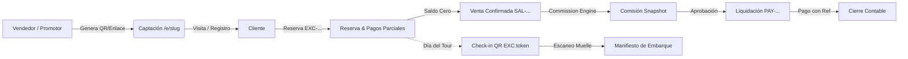
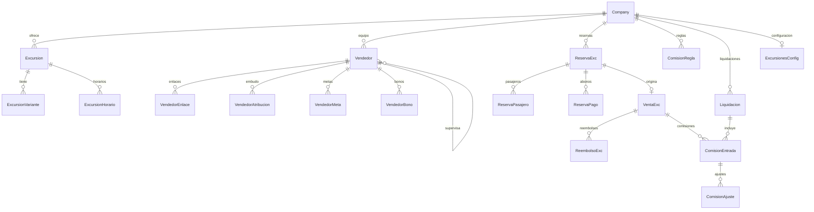
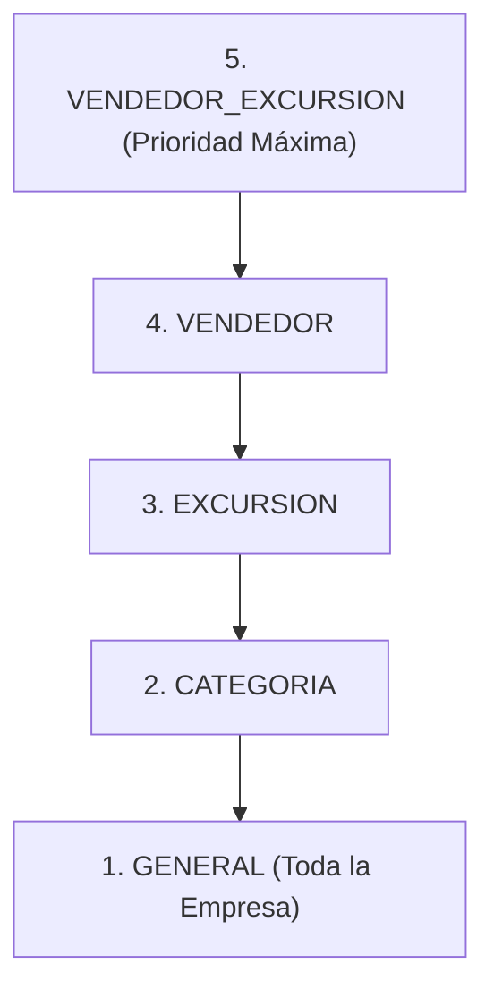
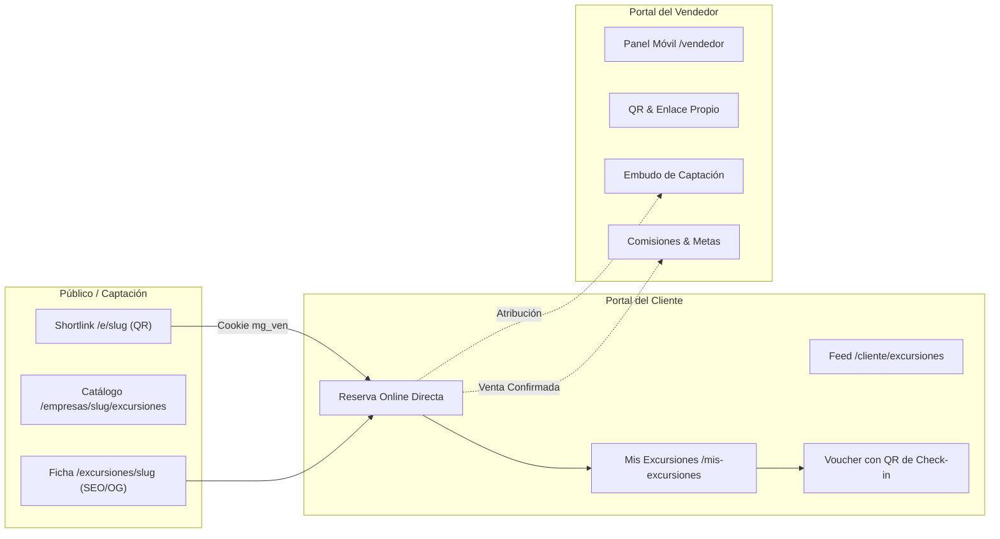

# Vertical de Excursiones — Documentación Técnica

Documentación técnica y operativa del módulo de **Excursiones** (*Sales & Commission Management*) de MembeGo, diseñado para empresas de tours, actividades turísticas y operadores receptivos.

---

## 1. Resumen Ejecutivo y Cadena de Valor

El módulo de Excursiones administra el ciclo de vida comercial, financiero y operativo de las empresas de tours dentro del ecosistema multi-tenant de MembeGo. Cubre desde la captación omnicanal hasta la liquidación final a promotores y el embarque de pasajeros en muelle o transporte.

### Cadena de Valor Auditada



```
Empresa → Vendedor → Enlace/QR → Cliente → Registro → Reserva → Pagos → Venta → Comisión (con snapshot) → Liquidación → Pago → Check-in
```

---

## 2. Principios Arquitectónicos y Convenciones

1. **Aislamiento Multi-Tenant Estricto**: Todas las operaciones y lecturas se ejecutan mediante `conEmpresa(companyId, tx => ...)` y respetan los contextos de tenant. No existen fugas cruzadas de identificadores, clientes ni reportes.
2. **Desacoplamiento del Núcleo (Flat IDs)**:
   - Dentro del dominio de excursiones existen relaciones Prisma completas (`@relation`).
   - Hacia entidades del núcleo (`Company`, `Cliente`, `User`, `Sucursal`, `Campana`), se almacenan identificadores planos (`companyId`, `clienteId`, `userId`, `sucursalId`) para preservar la modularidad fundacional sin acoplar el esquema central.
3. **Lógica de Negocio en Núcleos Puros (`nucleo.ts`)**:
   - Cada subdominio (`catalogo`, `vendedores`, `atribucion`, `reservas`, `ventas`, `comisiones`, `liquidaciones`, `checkin`, `metricas`, `reportes`) separa sus reglas matemáticas, validaciones y máquinas de estado en funciones puras sin dependencias de Prisma ni red.
   - 100% deterministas y cubiertas por pruebas unitarias automatizadas.
4. **Inmutabilidad y Trazabilidad Contable**:
   - **Los precios provienen del servidor**: El navegador nunca envía montos; el backend consulta el catálogo y congela precios e impuestos en la reserva.
   - **Nada se borra**: Los pagos se anulan mediante contra-asientos registrados; las reservas y ventas se cancelan preservando auditoría.
   - **Comisiones con Snapshot**: La comisión guarda una fotografía inmutable de la regla (`reglaSnapshot`) y una explicación legible (`desglose`). Modificar reglas a futuro no altera comisiones históricas.
   - **Comisiones pagadas no se anulan**: Se corrigen mediante `ComisionAjuste` con signo (+/−).
   - **Sin comisionar impuestos**: La base comisionable es el monto neto recibido por la empresa excluyendo el ITBIS/impuestos estatales.
5. **Manejo de Zona Horaria**:
   - Plataforma fijada en `America/Santo_Domingo` (`OFFSET_PLATAFORMA_MIN = -240`, UTC−4 todo el año sin horario de verano).
   - Los cierres de día, semanas comerciales (inicio en Lunes) y cortes mensuales operan en hora local para garantizar concordancia fiscal y operativa.
6. **Estados como String Validado**:
   - Se emplean cadenas (`'ACTIVA'`, `'PENDIENTE'`, etc.) tipadas en TypeScript en lugar de Enums de base de datos para facilitar migraciones y extensiones sin bloqueo de tablas.

---

## 3. Modelo de Datos (Prisma Schema)

El esquema se ubica en `prisma/schema/excursiones.prisma` y comprende 20 modelos agrupados en 5 dominios:



### 3.1 Catálogo
- **`Excursion`**: Nombre, slug único por empresa, portada, galería JSON, duración, punto de salida, horas de salida/regreso, políticas, estado (`ACTIVA`, `PAUSADA`, `AGOTADA`, `TEMPORAL`, `ARCHIVADA`), moneda (`DOP`, `USD`, `EUR`), impuesto porcentual (`impuestoPct`) y capacidad por salida.
- **`ExcursionVariante`**: Variantes de la excursión (ej. Estándar, VIP, Premium) con tarifas segmentadas (`precioAdulto`, `precioNino`, `precioResidente`, `precioTurista`) y capacidad particular.
- **`ExcursionHorario`**: Días de operación semanales (`diasSemana` en arreglo ISO `[1..7]`), hora de salida programada y cupo particular.

### 3.2 Vendedores y Atribución
- **`Vendedor`**: Identidad comercial con `codigo` estable único (`RAF-00001`), `userId` opcional (solo si se le otorga acceso al panel web), teléfono (clave anti-duplicados), tipo (`TipoVendedor`), jerarquía (`supervisorId`) y estado (`ACTIVO`, `SUSPENDIDO`, `INACTIVO`).
- **`VendedorEnlace`**: Slugs globales aleatorios (`/e/[slug]`) vinculados al vendedor y opcionalmente a campañas (`campanaId`).
- **`VendedorAtribucion`**: Registro inmutable de eventos del embudo (`VISITA`, `REGISTRO`, `RESERVA`, `COMPRA`), canal (`QR`, `ENLACE`, `WHATSAPP`, `REDES`), cookie de visitante (`visitorId`) y cliente asociado (`clienteId`).
- **`VendedorMeta`**: Objetivos comerciales por período (`DIARIA`, `SEMANAL`, `MENSUAL`, `RANGO`) sobre ventas, pasajeros, ingresos, registros o reservas.
- **`VendedorBono`**: Incentivos extraordinarios independientes de la comisión (`PENDIENTE`, `OTORGADO`, `PAGADO`, `ANULADA`).
- **`TipoVendedor`** y **`CanalVenta`**: Catálogos auxiliares configurables por empresa.

### 3.3 Reservas, Cobros y Ventas
- **`ReservaExc`**: Correlativo `numero` (`EXC-2026-000184`), `clienteId`, `vendedorId` atribuido, fecha, hora, conteo de adultos/niños, desglose económico (`subtotal`, `descuento`, `impuestos`, `total`), token de check-in (`checkinToken`), marca de embarque (`checkinAt`), notas y estado (`PENDIENTE`, `CONFIRMADA`, `PARCIALMENTE_PAGADA`, `PAGADA`, `COMPLETADA`, `CANCELADA`, `NO_SHOW`).
- **`ReservaPasajero`**: Registro individual de cada pasajero con tipo (`ADULTO`, `NINO`), nombre opcional, estado de embarque (`presente`) y marca de tiempo (`checkinAt`).
- **`ReservaPago`**: Historial de abonos con monto, moneda, método (`EFECTIVO`, `TARJETA`, `TRANSFERENCIA`, `DEPOSITO`, `LINK`), referencia externa, comprobante y estado (`REGISTRADO`, `ANULADO`).
- **`VentaExc`**: Transacción de cierre financiero `numero` (`SAL-000184`) vinculada de forma 1 a 1 a `reservaId`, congelando la atribución del vendedor y el número de pasajeros. Estados: `CONFIRMADA`, `COMPLETADA`, `CANCELADA`, `REEMBOLSADA`.
- **`ReembolsoExc`**: Historial de devoluciones asociadas a la venta.

### 3.4 Comisiones y Liquidaciones
- **`ComisionRegla`**: Reglas de comisión con ámbito (`GENERAL`, `CATEGORIA`, `EXCURSION`, `VENDEDOR`, `VENDEDOR_EXCURSION`), tipo de cálculo (`PORCENTAJE`, `FIJO_VENTA`, `FIJO_PASAJERO`, `FIJO_ADULTO`, `FIJO_NINO`, `ESCALON`, `PAQUETE_REGALO`), valor monetario o porcentual, escalones JSON y vigencias temporales.
- **`ComisionEntrada`**: Registro de comisión generado. Congela la base, el monto calculado, `reglaSnapshot` JSON, texto explicativo `desglose` y estado (`ESTIMADA`, `GENERADA`, `APROBADA`, `PENDIENTE_PAGO`, `PAGADA`, `ANULADA`).
- **`ComisionAjuste`**: Contra-asientos contables firmados con signo (+/−) vinculados a la comisión para cancelaciones o penalidades.
- **`Liquidacion`**: Agrupación de pago a un vendedor `numero` (`PAY-2026-0014`), rango de fechas, suma neta total, método, referencia bancaria y estado (`BORRADOR`, `APROBADA`, `PAGADA`, `ANULADA`).
- **`ExcursionesConfig`**: Parámetros del tenant: `politicaAtribucion` (`PRIMERA`, `ULTIMA`, `RESERVA`), `ventanaAtribucionDias` (defecto 30), `monedaDefecto`, `reglaAprobacion` (`MANUAL` o `AUTOMATICA`).

---

## 4. Motores y Lógica de Negocio (Core Modules)

### 4.1 Catálogo (`src/modules/excursiones/catalogo/`)
- Normaliza entradas del cliente/administrador.
- Soporta variantes con precios diferenciados (adulto, niño, residente, turista).
- Generación de slug único por empresa (`slugExcursion`), autocalculando hora de regreso a partir de duración y hora de salida.
- Sincronización automática de estado `AGOTADA` al alcanzar capacidad máxima en salidas programadas.

### 4.2 Vendedores y Accesos (`src/modules/excursiones/vendedores/`)
- Generación de código comercial correlativo `codigoVendedor(prefijo, correlativo)` (ej. `ISL-00001`).
- Generación de shortlink global único de 10 caracteres (`/e/abc123xyzw`) y URL de QR (`/e/abc123xyzw?c=qr`).
- Detección de duplicados por número de teléfono en el tenant.
- Provisión de acceso al panel de vendedor: crea usuario en Supabase Auth (`ensureEmailIdentity`), asigna rol `VENDEDOR` y genera contraseña temporal de un solo uso.

### 4.3 Motor de Atribución (`src/modules/excursiones/atribucion/`)
- **Ruta Shortlink `/e/[slug]`**:
  - Detección y filtrado de bots de vista previa de redes sociales (WhatsApp, Facebook, Twitter, Telegram) para evitar falsos positivos de visitas.
  - Generación/lectura de cookies `mg_vis` (identificador de visitante) y `mg_ven` (slug del vendedor).
  - Deduplicación de visitas por `visitorId` + `enlaceSlug` en una ventana de 24 horas.
  - Redirección inteligente al flujo de registro de la empresa con parámetros de preservación contextual.
- **Políticas de Atribución (`resolverVendedorAtribuido`)**:
  1. `PRIMERA`: Atribuye a quien captó originalmente al cliente (primer contacto dentro de la ventana de vigencia).
  2. `ULTIMA`: Atribuye al vendedor del enlace más reciente previo a la conversión.
  3. `RESERVA`: Atribuye al vendedor que levantó la reserva; si no existiera, recurre a la última interacción.

### 4.4 Reservas y Gestión de Pagos (`src/modules/excursiones/reservas/`)
- Generación de correlativo `EXC-YYYY-XXXXXX`.
- **Cálculo de Totales (`calcularTotales`)**:
  $$\text{Subtotal} = (\text{Adultos} \times \text{PrecioAdulto}) + (\text{Niños} \times \text{PrecioNiño})$$
  $$\text{Base Imponible} = \max(0, \text{Subtotal} - \text{Descuento})$$
  $$\text{Impuestos} = \text{Base Imponible} \times \left(\frac{\text{ImpuestoPct}}{100}\right)$$
  $$\text{Total} = \text{Base Imponible} + \text{Impuestos}$$
- **Máquina de Estados por Abonos (`estadoPorPagos`)**:
  - `PENDIENTE` (0 pagos registrados).
  - `PARCIALMENTE_PAGADA` (abonos > 0 pero < total).
  - `PAGADA` (abonos $\ge$ total).
  - Estados terminales/cerrados (`COMPLETADA`, `CANCELADA`, `NO_SHOW`) no son sobreescritos por eventos de pago tardíos.
- Anulación de pagos mediante inserción de movimiento de estado `ANULADO`, recalculando el saldo vivo en tiempo real.

### 4.5 Ventas (`src/modules/excursiones/ventas/`)
- Correlativo `SAL-XXXXXX`.
- Disparada al saldar la reserva al 100% (`procesarVentaYComisionInterna`).
- Garantiza idempotencia: una reserva solo puede tener una venta asociada.
- Congela la base comisionable: $\text{Base} = \text{Total} - \text{Impuestos}$.
- Registra el evento de etapa `COMPRA` en el histórico de atribución del vendedor.

### 4.6 Motor de Comisiones (`src/modules/excursiones/comisiones/`)

#### Jerarquía de Resolución de Reglas
Ante múltiples reglas vigentes, el motor resuelve por peso de especificidad (`PESO_AMBITO`):



*A igual nivel de especificidad, se selecciona la regla creada más recientemente.*

#### Tipos de Cálculo Soportados
- `PORCENTAJE`: $\% \times \text{Base Comisionable}$.
- `FIJO_VENTA`: Monto fijo por orden cerrada.
- `FIJO_PASAJERO`: $\text{Monto} \times (\text{Adultos} + \text{Niños})$.
- `FIJO_ADULTO`: $\text{Monto} \times \text{Adultos}$.
- `FIJO_NINO`: $\text{Monto} \times \text{Niños}$.
- `ESCALON`: Rango de pasajeros con porcentaje dinámico (ej. 1–5 pax: 10%, 6–15 pax: 15%, 16+ pax: 20%).
- `PAQUETE_REGALO`: Bono en especie/precio base tras acumular $N$ ventas del producto.

#### Protección y Topes
- Si la regla arroja un monto superior a la base comisionable, el cálculo se **topa automáticamente a la base**, documentándolo explícitamente en el desglose.
- Ciclo de vida de la comisión:
  $$\text{ESTIMADA} \longrightarrow \text{GENERADA} \longrightarrow \text{APROBADA} \longrightarrow \text{PENDIENTE\_PAGO} \longrightarrow \text{PAGADA}$$
  *(En cualquier etapa previa a PAGADA puede transicionar a ANULADA).*

### 4.7 Liquidaciones (`src/modules/excursiones/liquidaciones/`)
- Correlativo `PAY-YYYY-XXXX`.
- Agrupa comisiones en estado `APROBADA` o `PENDIENTE_PAGO` con neto $> 0$ dentro del período del vendedor que no pertenezcan a otra liquidación previa (`liquidacionId: null`).
- Transacción atómica: bloquea y vincula las comisiones simultáneamente para evitar condiciones de carrera por doble cobro.
- Registro del pago exige `referencia` bancaria/fiscal obligatoria para métodos distintos de efectivo (`TRANSFERENCIA`, `CHEQUE`, `DEPOSITO`).

### 4.8 Check-in Operativo y Manifiesto (`src/modules/excursiones/checkin/`)
- Token alfanumérico único global generado al crear la reserva, expresado en QR como `EXC:<token>`.
- Ventana de gracia operativa: $\pm 1$ día respecto a la fecha del tour.
- Desacoplamiento entre **búsqueda/inspección** y **confirmación de embarque** para evitar marcaciones involuntarias en muelle.
- Manifiesto diario con control de pasajeros esperados vs. presentes reales por salida.

### 4.9 Métricas, Metas y Reportes (`src/modules/excursiones/metricas/` y `reportes/`)
- **Consultas sobre filas reales**: Sin contadores desnormalizados.
- **KPIs**: Clientes captados, Reservas, Pasajeros reservados, Ventas confirmadas, Pasajeros reales, Ingresos netos, Ticket promedio ($\frac{\text{Ingresos}}{\text{Ventas}}$ o "—" si no hubo ventas), Comisiones generadas y Tasa de conversión de embudo.
- **Exportación CSV en Servidor**: Genera archivo estructurado en cuatro bloques jerárquicos: Resumen del Período, Ventas, Comisiones (con columna explícita de Ajustes) y Liquidaciones. Incluye advertencia explícita dentro del archivo si los datos superan el límite de exportación (`TOPE_EXPORTACION = 5000`).

---

## 5. Experiencia Pública, del Cliente y del Vendedor

El vertical de Excursiones expone tres experiencias dedicadas según el rol del usuario:



### 5.1 La Perspectiva Pública (Visitantes y Compartidos)

1. **Shortlinks Globales de Captación (`/e/[slug]`)**:
   - **Enrutador**: [src/app/e/[slug]/route.ts](file:///C:/Users/Usuario/projects/MEMBEGO/src/app/e/%5Bslug%5D/route.ts).
   - **Protección contra Bots**: Detecta *crawlers* y generadores de vista previa de WhatsApp, Telegram, Facebook, Twitter y LinkedIn (`esBotDeVistaPrevia`). Evita registrar visitas artificiales cuando el link simplemente se comparte en un chat.
   - **Gestión de Cookies**:
     - `mg_vis`: Identificador anónimo de visitante (expira en 365 días).
     - `mg_ven`: Slug del vendedor asignado (expira según `ExcursionesConfig.ventanaAtribucionDias`, defecto 30 días).
   - **Deduplicación**: Registra máximo 1 evento de etapa `VISITA` por cada combinación de `visitorId` + `enlaceSlug` en un período de 24 horas.
   - **Redirección Contextual**: Envía al usuario a `/registro/[companySlug]?v=[codigoVendedor]&e=[slug]&next=/empresas/[companySlug]/excursiones`, mostrando en el onboarding el mensaje cordial: *«Te atiende [Nombre del Vendedor]»*.

2. **Catálogo Público de la Empresa (`/empresas/[companySlug]/excursiones`)**:
   - Permite a visitantes no autenticados explorar todas las excursiones activas de una empresa específica.
   - Muestra tarjetas enriquecidas con portada, galería, duración, ubicación, categoría, precios "Desde" por variante y badges de estado.

3. **Ficha Pública de Excursión (`/empresas/[companySlug]/excursiones/[excursionSlug]`)**:
   - **Metadatos Dinámicos / SEO**: Genera OpenGraph y Twitter Cards con título, descripción y portada optimizada para compartir en redes (`generateMetadata`).
   - **Contenido Detallado**: Punto de encuentro, horas de salida/regreso, políticas de cancelación, ítems incluidos y no incluidos.
   - **Reserva Online**: Si el usuario está autenticado, permite reservar de inmediato; si no lo está, lo guía al registro/login preservando los parámetros de la excursión seleccionada.

---

### 5.2 La Perspectiva del Cliente (`/cliente/excursiones` y `/cliente/mis-excursiones`)

1. **Feed y Búsqueda de Excursiones (`/cliente/excursiones`)**:
   - **Búsqueda Avanzada**: Filtrado por texto libre, categoría, empresa afiliada y disponibilidad de cupos ([`buscarExcursionesCliente`](file:///C:/Users/Usuario/projects/MEMBEGO/src/modules/excursiones/catalogo/cliente-queries.ts)).
   - **Secciones Destacadas**: Agrupaciones visuales de "Más populares", "Nuevas experiencias" y "Próximas salidas".

2. **Proceso de Reserva Directa (`reservarExcursion`)**:
   - El cliente selecciona fecha, horario/turno, variante (ej. Estándar vs VIP) y cantidad de adultos/niños.
   - **Atribución Transparente**: La acción del servidor verifica la presencia de la cookie `mg_ven` o el histórico del cliente ([`vendedorParaCliente`](file:///C:/Users/Usuario/projects/MEMBEGO/src/modules/excursiones/atribucion/registrar.ts)). Si existe atribución vigente, la reserva nace con el vendedor asignado sin requerir intervención del usuario.
   - **Cálculo de Precios Seguro**: La tarifa se lee del catálogo en el servidor; el cliente no puede alterar montos desde la UI.

3. **Gestión de Mis Excursiones (`/cliente/mis-excursiones`)**:
   - Panel consolidado multi-empresa: si el cliente tiene reservas con varios operadores, las visualiza todas en un único lugar.
   - **Segmentación Temporal**:
     - *Próximas Salidas*: Tarjetas con estado en vivo, cuenta regresiva y acceso directo al pase de abordar.
     - *Historial de Pasadas*: Archivo de tours completados o cancelados.

4. **Voucher Digital y QR de Embarque (`/cliente/mis-excursiones/[reservaId]`)**:
   - Muestra el **QR de Check-in Transaccional** (`EXC:<token>`).
   - Detalle del punto de encuentro, hora de presentación, saldo pendiente por pagar (si aplica) y políticas del operador.
   - Al ser escaneado por el operador en el muelle, el pase se actualiza dinámicamente mostrando la hora exacta de embarque confirmada.

---

### 5.3 La Perspectiva del Vendedor (`/vendedor`)

1. **Acceso Exclusivo y Seguridad**:
   - Rol de usuario: `VENDEDOR`.
   - **Aislamiento Total**: Utiliza una plantilla mínima ([src/app/(vendedor)/layout.tsx](file:///C:/Users/Usuario/projects/MEMBEGO/src/app/%28vendedor%29/layout.tsx)) que no carga el AppShell administrativo de MembeGo.
   - **Bloqueo Fail-Closed**: Cualquier intento de navegar a `/admin/*` o a módulos generales de la empresa es rechazado de inmediato por las guardias de sesión.

2. **Panel Principal del Vendedor (`/vendedor`)**:
   - **Resumen Financiero**:
     - *Por Cobrar*: Suma de comisiones en estado `APROBADA` o `PENDIENTE_PAGO` aún no liquidadas.
     - *Ya Cobrado*: Total histórico de liquidaciones efectivamente pagadas.
   - **Tarjeta de QR y Enlace**:
     - Muestra su código comercial (`RAF-00001`).
     - Botón para copiar su enlace corto (`membego.com/e/abc123xyzw`).
     - Botón para descargar el código QR en alta resolución optimizado para imprimir en volantes, mostradores de hotel o tarjetas personales.

3. **Embudo de Captación en Tiempo Real**:
   - Visualiza cuántos prospectos ha atraído en cada fase del embudo sin ver datos sensibles de otros promotores:
     - **Visitas**: Cantidad de personas que abrieron su enlace o escanearon su QR.
     - **Registros**: Clientes que crearon cuenta en la plataforma tras entrar por su enlace.
     - **Reservas**: Clientes captados que generaron al menos una reserva.
     - **Compras**: Reservas que fueron saldadas y convertidas en ventas.

4. **Monitor de Metas Comerciales**:
   - Visualiza las metas asignadas por la administración (Diarias, Semanales o Mensuales).
   - Componente [`MetaProgreso`](file:///C:/Users/Usuario/projects/MEMBEGO/src/components/excursiones/MetaProgreso.tsx) que refleja en tiempo real el avance hacia el objetivo en ventas, pasajeros, registros o ingresos.

5. **Historial de Reservas y Comisiones**:
   - `/vendedor/reservas`: Listado de reservas donde figura como vendedor atribuido, con estado de pago y fecha de salida.
   - `/vendedor/comisiones`: Detalle de comisiones generadas por cada venta, visualizando el cálculo y estado de liquidación.

---

## 6. Mapeo Completo de Rutas y Navegación

### Panel Administrativo (`/admin/excursiones`)

| Ruta | Componente / Propósito |
|---|---|
| `/admin/excursiones` | Dashboard del módulo: selector de período (Hoy, Semana, Mes), KPIs de ventas/captación, ranking del equipo y accesos directos. |
| `/admin/excursiones/catalogo` | Listado de tours y excursiones con estado, moneda y precios. |
| `/admin/excursiones/catalogo/nueva` | Formulario de alta con variantes y configuración de horarios. |
| `/admin/excursiones/catalogo/[id]` | Edición general, gestión de variantes, horarios y control de estado (`Activa`, `Pausada`, etc.). |
| `/admin/excursiones/vendedores` | Listado del equipo comercial, tipos, estados y enlaces activos. |
| `/admin/excursiones/vendedores/nuevo` | Asistente de alta de vendedor con generación de código y enlace/QR. |
| `/admin/excursiones/vendedores/[id]` | Ficha completa: embudo de captación por QR, edición, QR descargable, jerarquía y gestión de credenciales. |
| `/admin/excursiones/reservas` | Listado y filtros de reservas por estado, fecha y vendedor. |
| `/admin/excursiones/reservas/nueva` | Creación de reserva manual: selección de cliente, tour, cálculo de tarifas del servidor y atribución. |
| `/admin/excursiones/reservas/[id]` | Ficha de reserva: detalle de pasajeros, registro de abonos parciales, anulación de pagos, confirmación de venta y visualización de QR de check-in. |
| `/admin/excursiones/comisiones` | Bandeja de comisiones generadas, desglose por venta, neto tras ajustes y botones de aprobación/anulación. |
| `/admin/excursiones/comisiones/reglas` | Gestor de reglas comerciales por ámbito (Vendedor + Excursión, General, Escalones). |
| `/admin/excursiones/liquidaciones` | Historial de pagos y generador de liquidaciones por vendedor/período. |
| `/admin/excursiones/liquidaciones/[id]` | Detalle de liquidación: desglose de comisiones liquidadas, aprobación, pago con referencia y anulación. |
| `/admin/excursiones/checkin` | Escáner y buscador de reservas por QR/código, validación de fecha y manifiesto de embarque del día. |
| `/admin/excursiones/metas` | Monitor de objetivos comerciales por vendedor con barras de progreso en tiempo real. |
| `/admin/excursiones/reportes` | Selector de rango de fechas y descarga de reporte contable consolidado en CSV. |
| `/admin/excursiones/reportes/exportar` | Route Handler (`GET`) que transmite el CSV con codificación UTF-8 BOM. |

### Portal del Vendedor (`/vendedor`)

| Ruta | Propósito |
|---|---|
| `/vendedor` | Dashboard personal: balance por cobrar/cobrado, tarjeta QR descargable, embudo de captación y metas. |
| `/vendedor/reservas` | Listado de reservas atribuidas al vendedor con estado de pago y pasajeros. |
| `/vendedor/comisiones` | Historial de comisiones ganadas con su desglose y estado de liquidación. |

### Portal del Cliente (`/cliente`)

| Ruta | Propósito |
|---|---|
| `/cliente/excursiones` | Catálogo de experiencias disponibles para reservar con filtros por categoría y búsqueda. |
| `/cliente/mis-excursiones` | Listado de reservas activas y pasadas del cliente en todas sus empresas afiliadas. |
| `/cliente/mis-excursiones/[reservaId]` | Voucher interactivo con código QR de check-in, datos del punto de salida y estado de pago. |

### Rutas Públicas

| Ruta | Propósito |
|---|---|
| `/e/[slug]` | Endpoint de captura de atribución de vendedor/QR, filtrado de bots y redirección al registro. |
| `/empresas/[companySlug]/excursiones` | Catálogo público web de las excursiones ofrecidas por la empresa. |
| `/empresas/[companySlug]/excursiones/[excursionSlug]` | Ficha pública del tour con OpenGraph dinámico, itinerario y formulario de reserva. |

---

## 7. Componentes de UI (`src/components/excursiones/`)

- **`ExcursionesTabs.tsx`**: Barra de navegación secundaria persistente en la cabecera del módulo administrativo.
- **`VendedorTabs.tsx`**: Navegación móvil optimizada para el portal del vendedor (`Inicio`, `Reservas`, `Comisiones`).
- **`ExcursionForm.tsx`**, **`VariantesEditor.tsx`**, **`HorariosEditor.tsx`**: Formularios modulares para la parametrización de tours y tarifas.
- **`VendedorForm.tsx`**, **`VendedorWizard.tsx`**, **`VendedorQrCard.tsx`**, **`VendedorAcceso.tsx`**: Componentes de alta, edición, descarga de QR en alta resolución y generación de accesos al sistema.
- **`ReservaForm.tsx`**, **`ReservaPagos.tsx`**, **`ReservaEstadoBotones.tsx`**: Gestión de reservas, registro dinámico de pagos parciales y transiciones de estado.
- **`ReservaCheckinQrDisplay.tsx`**, **`CheckinScanner.tsx`**: Renderizado de códigos QR transaccionales y lector de cámara/código con retroalimentación inmediata.
- **`ReglaComisionForm.tsx`**, **`ComisionAcciones.tsx`**, **`LiquidacionForm.tsx`**, **`LiquidacionAcciones.tsx`**: Formularios y controles contables para la administración de comisiones y pagos.
- **`MetaForm.tsx`**, **`MetaProgreso.tsx`**: Componentes de visualización y control de metas de ventas.
- **`ReporteDescarga.tsx`**: Diálogo y enlace de descarga de reportes en CSV con selección de rango de fechas.

---

## 8. Seguridad, Permisos y Auditoría

### Control de Acceso por Capacidades y Roles
- La sección requiere la capacidad global `EXCURSIONES` activada en la empresa (`requireSection('excursiones')`).
- Permisos granulares por acción mediante submódulos de seguridad:
  - `catalogo_crear`, `catalogo_editar`
  - `vendedor_crear`, `vendedor_editar`, `vendedor_acceso`
  - `reserva_crear`, `reserva_editar`, `reserva_pago`
  - `comision_aprobar`, `comision_anular`, `comision_reglas`
  - `liquidacion_crear`, `liquidacion_pagar`, `liquidacion_anular`
  - `checkin_registrar`
  - `reporte_exportar`
- Los vendedores con cuenta propia acceden exclusivamente a `/vendedor` con rol `VENDEDOR`, quedando bloqueados de rutas administrativas mediante guardias de servidor.

### Auditoría Centralizada (`AuditLog`)
Toda mutación crítica invoca la función interna `auditar(...)`, registrando en la base de datos:
- `companyId`, `userId`, `accion` (`'NOTA_INTERNA'`), `entidadTipo` (`Excursion`, `Vendedor`, `ReservaExc`, `VentaExc`, `ComisionEntrada`, `Liquidacion`), `entidadId`, `payload` JSON con valores anteriores/nuevos, IP y User-Agent de la solicitud.

---

## 9. Verificación y Calidad (QA)

El módulo cuenta con una suite automatizada de pruebas unitarias sobre los núcleos puros (aritmética financiera, jerarquía de comisiones, resolución de atribución, cortes de período y formato de CSV), complementada por el protocolo de prueba de punta a punta documentado en [EXCURSIONES-QA.md](file:///C:/Users/Usuario/projects/MEMBEGO/docs/EXCURSIONES-QA.md).
