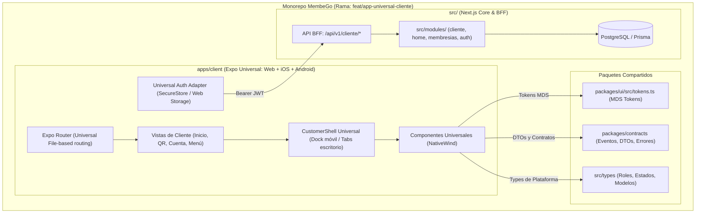

# App Universal de Clientes (Web + iOS + Android) Implementation Plan

> **For agentic workers:** REQUIRED SUB-SKILL: Use superpowers:subagent-driven-development to implement this plan task-by-task. Steps use checkbox (`- [ ]`) syntax for tracking.

**Goal:** Construir la aplicación universal de clientes para MembeGo (`apps/client`), ejecutándose en Web responsiva y como app nativa móvil (iOS y Android) usando Expo SDK 52, Expo Router y NativeWind v4, consumiendo los contratos tipados de `@membego/contracts`, tokens de diseño MDS y una capa API BFF en Next.js.

**Architecture:**
Se añade `apps/client` como workspace monorepo con Expo y Expo Router. Los componentes cliente se construyen con NativeWind v4 consumiendo los tokens sRGB/hex de `packages/ui/src/tokens.ts`. En pantallas móviles (< 768px) se muestra el dock inferior con los 4 destinos canónicos (Inicio, Mi QR, Cuenta, Menú); en pantallas de escritorio (≥ 768px) la navegación se adapta a pestañas superiores. La app se conecta a Next.js a través de endpoints seguros en `src/app/api/v1/cliente/*` autenticados mediante Bearer JWT con Supabase.

**Architecture Diagram:**



**Tech Stack:**
- Expo SDK 52+, Expo Router v4
- React Native 0.76+ & React Native Web
- NativeWind v4 (Tailwind para React Native)
- `@supabase/supabase-js` + `expo-secure-store`
- `@tanstack/react-query` v5
- `lucide-react-native`
- `react-native-qrcode-svg`
- Next.js 16 App Router (Capa API BFF)
- TypeScript 5, Node 22

**Spec:** [`docs/superpowers/specs/2026-09-11-app-movil-cliente-design.md`](file:///C:/Users/Usuario/projects/MEMBEGO/docs/superpowers/specs/2026-09-11-app-movil-cliente-design.md) (Commit: `11edee90`)

## Global Constraints
- Rama de trabajo: `feat/app-universal-cliente` (derivada de `claude/transformacion-cliente`).
- Código del cliente universal vive en `apps/client`.
- Cero regresiones o impacto en el portal administrativo y módulos core existentes en `src/`.
- No alterar esquemas Prisma ni migraciones para este requerimiento.
- Reutilizar directamente contratos de `@membego/contracts` y tipos de `src/types/index.ts`.
- Mapear exactamente los tokens de diseño de `packages/ui/src/tokens.ts`.
- Tamaño táctil mínimo de 44x44px en botones e iconos (`minTouchTarget`).

---

### Task 1: Scaffolding de `apps/client` y Configuración Monorepo

**Files:**
- Create: `apps/client/package.json`
- Create: `apps/client/app.json`
- Create: `apps/client/metro.config.js`
- Create: `apps/client/tailwind.config.js`
- Create: `apps/client/tsconfig.json`
- Create: `apps/client/global.d.ts`
- Modify: `package.json:1-129`

**Interfaces:**
- Consumes: `packages/ui/src/tokens.ts`, `packages/contracts/src/index.ts`, `src/types/index.ts`
- Produces: Base ejecutable para Expo (Web + Nativo) en `apps/client` con resolución de paquetes monorepo.

- [ ] **Step 1: Crear `apps/client/package.json`**

```json
{
  "name": "@membego/client",
  "version": "0.1.0",
  "private": true,
  "main": "expo-router/entry",
  "scripts": {
    "start": "expo start",
    "web": "expo start --web",
    "android": "expo start --android",
    "ios": "expo start --ios",
    "build:web": "expo export --platform web",
    "typecheck": "tsc --noEmit"
  },
  "dependencies": {
    "@membego/contracts": "workspace:*",
    "@supabase/supabase-js": "^2.50.0",
    "@tanstack/react-query": "^5.67.0",
    "expo": "~52.0.37",
    "expo-blur": "~14.0.3",
    "expo-brightness": "~13.0.3",
    "expo-constants": "~17.0.7",
    "expo-font": "~13.0.4",
    "expo-haptics": "~14.0.1",
    "expo-linear-gradient": "~14.0.2",
    "expo-linking": "~7.0.5",
    "expo-location": "~18.0.7",
    "expo-router": "~4.0.17",
    "expo-secure-store": "~14.0.1",
    "expo-status-bar": "~2.0.1",
    "lucide-react-native": "^0.475.0",
    "nativewind": "^4.1.23",
    "react": "18.3.1",
    "react-dom": "18.3.1",
    "react-native": "0.76.7",
    "react-native-qrcode-svg": "^6.3.15",
    "react-native-reanimated": "~3.16.7",
    "react-native-safe-area-context": "4.12.0",
    "react-native-screens": "~4.4.0",
    "react-native-svg": "15.8.0",
    "react-native-web": "~0.19.13"
  },
  "devDependencies": {
    "@babel/core": "^7.26.0",
    "@types/react": "~18.3.12",
    "tailwindcss": "^3.4.17",
    "typescript": "^5.3.3"
  }
}
```

- [ ] **Step 2: Crear `apps/client/metro.config.js` para Monorepo**

```javascript
const { getDefaultConfig } = require('expo/metro-config')
const { withNativeWind } = require('nativewind/metro')
const path = require('path')

const projectRoot = __dirname
const monorepoRoot = path.resolve(projectRoot, '../..')

const config = getDefaultConfig(projectRoot)

// Monorepo: Vigilar directorios compartidos packages y src
config.watchFolders = [
  monorepoRoot,
  path.resolve(monorepoRoot, 'packages'),
  path.resolve(monorepoRoot, 'src')
]

config.resolver.nodeModulesPaths = [
  path.resolve(projectRoot, 'node_modules'),
  path.resolve(monorepoRoot, 'node_modules')
]

config.resolver.disableHierarchicalLookup = true

module.exports = withNativeWind(config, { input: './global.css' })
```

- [ ] **Step 3: Crear `apps/client/tailwind.config.js` y `apps/client/global.css`**

```javascript
const tokens = require('../../packages/ui/src/tokens')

/** @type {import('tailwindcss').Config} */
module.exports = {
  content: ['./app/**/*.{js,jsx,ts,tsx}', './src/**/*.{js,jsx,ts,tsx}'],
  presets: [require('nativewind/preset')],
  theme: {
    extend: {
      colors: {
        primary: {
          50: '#f0f6ff',
          100: '#ddecff',
          500: '#0084ff',
          600: '#006bed',
          700: '#0059ce',
          DEFAULT: '#006bed',
        },
        navy: '#0b1220',
        vibe: {
          violeta: '#7c3aed',
          sky: '#38bdf8',
          aqua: '#06b6d4',
        },
        state: {
          success: '#00864d',
          warning: '#ab6300',
          danger: '#e7000b',
        }
      },
      borderRadius: {
        '2xl': '20px',
        xl: '14px',
        lg: '12px',
        md: '10px',
      }
    },
  },
  plugins: [],
}
```

- [ ] **Step 4: Configurar `apps/client/tsconfig.json` y `app.json`**

```json
{
  "extends": "expo/tsconfig.base",
  "compilerOptions": {
    "strict": true,
    "baseUrl": ".",
    "paths": {
      "@/*": ["./src/*"],
      "@membego/contracts": ["../../packages/contracts/src/index.ts"],
      "@membego/ui/tokens": ["../../packages/ui/src/tokens.ts"],
      "@/types": ["../../src/types/index.ts"]
    }
  },
  "include": ["**/*.ts", "**/*.tsx", ".expo/types/**/*.ts", "expo-env.d.ts"]
}
```

- [ ] **Step 5: Agregar scripts auxiliares en root `package.json`**

Agregar scripts para ejecutar la app de cliente desde la raíz:
`"client:dev": "npm --prefix apps/client run start"`, `"client:web": "npm --prefix apps/client run web"`.

- [ ] **Step 6: Commit de configuración de la app cliente**

```bash
git add apps/client package.json
git commit -m "feat(client): scaffolding de app universal Expo en apps/client"
```

---

### Task 2: Adaptador de Almacenamiento Universal y Cliente Supabase

**Files:**
- Create: `apps/client/src/lib/storage.ts`
- Create: `apps/client/src/lib/supabase.ts`
- Create: `apps/client/src/lib/auth-context.tsx`
- Create: `apps/client/tests/storage.test.ts`

**Interfaces:**
- Consumes: `@supabase/supabase-js`, `expo-secure-store`
- Produces: `universalStorage`, `supabase`, `useAuth` hook con soporte universal Web + Mobile.

- [ ] **Step 1: Escribir prueba unitaria para `universalStorage`**

Crear prueba en `apps/client/tests/storage.test.ts` verificando `setItem`, `getItem` y `removeItem` en entorno Node/Web.

- [ ] **Step 2: Implementar `apps/client/src/lib/storage.ts`**

```typescript
import { Platform } from 'react-native'
import * as SecureStore from 'expo-secure-store'

export const universalStorage = {
  getItem: async (key: string): Promise<string | null> => {
    if (Platform.OS === 'web') {
      return typeof window !== 'undefined' ? localStorage.getItem(key) : null
    }
    try {
      return await SecureStore.getItemAsync(key)
    } catch {
      return null
    }
  },
  setItem: async (key: string, value: string): Promise<void> => {
    if (Platform.OS === 'web') {
      if (typeof window !== 'undefined') localStorage.setItem(key, value)
      return
    }
    try {
      await SecureStore.setItemAsync(key, value)
    } catch (e) {
      console.error('Error guardando en SecureStore:', e)
    }
  },
  removeItem: async (key: string): Promise<void> => {
    if (Platform.OS === 'web') {
      if (typeof window !== 'undefined') localStorage.removeItem(key)
      return
    }
    try {
      await SecureStore.deleteItemAsync(key)
    } catch (e) {
      console.error('Error eliminando de SecureStore:', e)
    }
  },
}
```

- [ ] **Step 3: Implementar `apps/client/src/lib/supabase.ts` y `auth-context.tsx`**

Inicializar Supabase con `universalStorage` como `auth.storage` y autoRefreshToken habilitado.
Proveer `AuthContext` con métodos: `login({ email, password })`, `logout()`, `user`, `role`, `isAuthenticated`.

- [ ] **Step 4: Ejecutar pruebas y commit**

```bash
git add apps/client/src/lib apps/client/tests
git commit -m "feat(client): autenticacion universal con Supabase y adaptador de almacenamiento"
```

---

### Task 3: Capa API BFF en Next.js (`src/app/api/v1/cliente/*`)

**Files:**
- Create: `src/app/api/v1/cliente/guard.ts`
- Create: `src/app/api/v1/cliente/inicio/route.ts`
- Create: `src/app/api/v1/cliente/qr/route.ts`
- Create: `src/app/api/v1/cliente/perfil/route.ts`
- Create: `src/app/api/v1/cliente/menu/route.ts`
- Create: `src/app/api/v1/cliente/buscar/route.ts`
- Create: `tests/api-mobile-cliente.test.ts`

**Interfaces:**
- Consumes: `src/modules/cliente/queries.ts`, `src/modules/home/lectura.ts`, `src/modules/cliente/panelPersonal.ts`, `src/lib/auth`
- Produces: Endpoints JSON REST protegidos para el cliente universal.

- [ ] **Step 1: Escribir prueba para los endpoints BFF**

Crear `tests/api-mobile-cliente.test.ts` verificando que peticiones sin cabecera `Authorization` retornen 401 Unauthorized y peticiones válidas retornen 200 con el esquema tipado.

- [ ] **Step 2: Implementar `src/app/api/v1/cliente/guard.ts`**

Función `verificarClienteApi(req: Request)` que valida el token Supabase y extrae `SessionUser` verificando `metadata.role === 'CLIENTE'`.

- [ ] **Step 3: Implementar endpoints `/inicio`, `/qr`, `/perfil`, `/menu`, `/buscar`**

Reutilizar `getInicioVista(user)` y `cargarPanelPersonal(user)` para `/inicio`, y los servicios correspondientes para los demás endpoints.

- [ ] **Step 4: Ejecutar tests y commit**

```bash
npx tsx --test tests/api-mobile-cliente.test.ts
git add src/app/api/v1/cliente tests/api-mobile-cliente.test.ts
git commit -m "feat(api): endpoints BFF v1 para cliente universal (/inicio, /qr, /perfil, /menu, /buscar)"
```

---

### Task 4: Primitivas UI Universales y Cliente HTTP en `apps/client`

**Files:**
- Create: `apps/client/src/lib/api.ts`
- Create: `apps/client/src/components/ui/Button.tsx`
- Create: `apps/client/src/components/ui/Card.tsx`
- Create: `apps/client/src/components/ui/Badge.tsx`
- Create: `apps/client/src/components/ui/Skeleton.tsx`
- Create: `apps/client/src/hooks/useClienteData.ts`

**Interfaces:**
- Consumes: NativeWind, `apps/client/src/lib/supabase.ts`
- Produces: Primitivas UI de diseño MDS con área táctil mínima 44px y hooks de datos.

- [ ] **Step 1: Implementar `apps/client/src/lib/api.ts`**

Cliente HTTP fetch universal que inyecta automáticamente el token de Supabase en cabecera `Authorization: Bearer <jwt>`.

- [ ] **Step 2: Implementar componentes UI universales**

Crear `Button` (variantes `primary`, `vibe`, `outline`, `ghost`, con soporte de haptics táctil), `Card`, `Badge` y `SkeletonShimmer`.

- [ ] **Step 3: Implementar hooks React Query `useClienteData`**

Hooks `useInicio()`, `useQr()`, `usePerfil()`, `useMenu()` con cacheTime y manejo de estado de refresco.

- [ ] **Step 4: Commit de primitivas y capa de datos**

```bash
git add apps/client/src/components/ui apps/client/src/hooks apps/client/src/lib/api.ts
git commit -m "feat(client): primitivas UI MDS y hooks de consulta de datos"
```

---

### Task 5: Layout Universal y Navegación Adaptativa (Expo Router)

**Files:**
- Create: `apps/client/app/_layout.tsx`
- Create: `apps/client/src/components/layout/HeaderVibe.tsx`
- Create: `apps/client/src/components/layout/PillUbicacion.tsx`
- Create: `apps/client/src/components/layout/BottomTabDock.tsx`
- Create: `apps/client/src/components/layout/TabsEscritorio.tsx`
- Create: `apps/client/app/(tabs)/_layout.tsx`

**Interfaces:**
- Consumes: Expo Router, `expo-linear-gradient`, `lucide-react-native`
- Produces: Layout adaptativo (Dock en móvil < 768px, Tabs superiores en escritorio ≥ 768px).

- [ ] **Step 1: Implementar `HeaderVibe.tsx` y `PillUbicacion.tsx`**

Cabecera violeta degradada `#5b21b6 -> #7c3aed -> #2563eb -> #06b6d4` con input de búsqueda, botón a `/qr`, campana de novedades y avatar con iniciales.

- [ ] **Step 2: Implementar `BottomTabDock.tsx` y `TabsEscritorio.tsx`**

- `BottomTabDock`: 4 destinos fijos con altura mínima respetando safe-area en móvil (`md:hidden`).
- `TabsEscritorio`: Fila de pestañas horizontales visible en desktop (`hidden md:flex`) con ancho centrado `max-w-4xl`.

- [ ] **Step 3: Configurar `apps/client/app/_layout.tsx` y `(tabs)/_layout.tsx`**

Configurar Root Stack y Tab Navigator con iconos `Home`, `QrCode`, `User`, `Menu`.

- [ ] **Step 4: Commit del layout universal**

```bash
git add apps/client/app apps/client/src/components/layout
git commit -m "feat(client): layout y navegacion universal adaptativa con Expo Router"
```

---

### Task 6: Pantalla Inicio Retail Universal (`(tabs)/inicio.tsx`)

**Files:**
- Create: `apps/client/src/components/inicio/VibeHero.tsx`
- Create: `apps/client/src/components/inicio/VibeCategorias.tsx`
- Create: `apps/client/src/components/inicio/VibeRelampago.tsx`
- Create: `apps/client/src/components/inicio/VibeRelacionado.tsx`
- Create: `apps/client/src/components/inicio/VibeReferidos.tsx`
- Create: `apps/client/app/(tabs)/inicio.tsx`

**Interfaces:**
- Consumes: `useInicio()` hook, tipos `InicioVista`, `PanelPersonal`
- Produces: Pantalla completa de Inicio Retail universal con pull-to-refresh.

- [ ] **Step 1: Implementar componentes modulares de inicio**

- `VibeHero`: Carrusel con `FlatList` horizontal y paginador.
- `VibeCategorias`: Chips horizontales con haptic feedback al pulsar.
- `VibeRelampago`: Ofertas relámpago con temporizador regresivo.
- `VibeRelacionado`: Membresías sugeridas.
- `VibeReferidos`: Banner con botón de compartir nativo (`Share.share` en móvil, `navigator.share` / clipboard en web).

- [ ] **Step 2: Ensamblar `apps/client/app/(tabs)/inicio.tsx`**

Integrar bloques modulares con `ScrollView`, `RefreshControl` nativo y `Skeleton` durante la carga.

- [ ] **Step 3: Commit de la pantalla Inicio**

```bash
git add apps/client/src/components/inicio apps/client/app/\(tabs\)/inicio.tsx
git commit -m "feat(client): pantalla Inicio Retail universal con bloques Stitch"
```

---

### Task 7: Pantalla Mi QR y Carnet de Membresía (`(tabs)/qr.tsx`)

**Files:**
- Create: `apps/client/src/components/qr/QrCodeCard.tsx`
- Create: `apps/client/src/components/qr/MembershipBadge.tsx`
- Create: `apps/client/app/(tabs)/qr.tsx`

**Interfaces:**
- Consumes: `useQr()` hook, `react-native-qrcode-svg`, `expo-brightness`
- Produces: Pantalla de carnet digital con QR dinámico optimizado para lectura en terminales.

- [ ] **Step 1: Implementar `QrCodeCard.tsx`**

Renderizar código QR SVG de alta nitidez, con opción de alternar entre empresas si el cliente tiene múltiples membresías.

- [ ] **Step 2: Implementar `apps/client/app/(tabs)/qr.tsx`**

- En móvil: activar brillo máximo temporalmente con `expo-brightness`.
- Mostrar fecha de expiración, estado de membresía y botón para forzar actualización del token.

- [ ] **Step 3: Commit de Mi QR**

```bash
git add apps/client/src/components/qr apps/client/app/\(tabs\)/qr.tsx
git commit -m "feat(client): pantalla Mi QR y carnet digital universal"
```

---

### Task 8: Pantallas Cuenta, Menú y Búsqueda

**Files:**
- Create: `apps/client/app/(tabs)/cuenta.tsx`
- Create: `apps/client/app/(tabs)/menu.tsx`
- Create: `apps/client/app/buscar.tsx`

**Interfaces:**
- Consumes: `usePerfil()`, `useMenu()`, `useAuth()`
- Produces: Vistas restantes del flujo canónico del cliente.

- [ ] **Step 1: Implementar `apps/client/app/(tabs)/cuenta.tsx`**

Ficha de perfil con nombre, correo, lista de vehículos afiliados, historial de visitas y accesos a pagos.

- [ ] **Step 2: Implementar `apps/client/app/(tabs)/menu.tsx`**

Directorio completo con lista de categorías, accesos a empresas, soporte y botón de cerrar sesión.

- [ ] **Step 3: Implementar `apps/client/app/buscar.tsx`**

Buscador unificado en tiempo real con debounce y listado de resultados por categoría.

- [ ] **Step 4: Commit de pantallas Cuenta, Menú y Búsqueda**

```bash
git add apps/client/app/\(tabs\)/cuenta.tsx apps/client/app/\(tabs\)/menu.tsx apps/client/app/buscar.tsx
git commit -m "feat(client): pantallas de Cuenta, Menu y Busqueda unificada"
```

---

### Task 9: Verificación de Builds (Web + Mobile), Scripts CI y Documentación

**Files:**
- Create: `apps/client/README.md`
- Modify: `package.json`

**Interfaces:**
- Consumes: Monorepo completo
- Produces: Builds verificados para Web y Mobile sin errores de TypeScript.

- [ ] **Step 1: Verificar export web de Expo**

Ejecutar: `npx expo export --platform web` dentro de `apps/client`.
Verificar que genere la carpeta `dist/` con el bundle web sin advertencias críticas.

- [ ] **Step 2: Verificar typecheck del monorepo**

Ejecutar: `npm run typecheck` en la raíz y verificar que pase sin errores de tipado.

- [ ] **Step 3: Crear `apps/client/README.md`**

Documentar instrucciones de ejecución local (`npm run client:dev`, `npm run client:web`), arquitectura de componentes y flujo de despliegue.

- [ ] **Step 4: Commit final de verificación y documentación**

```bash
git add apps/client/README.md package.json
git commit -m "docs(client): documentacion y verificacion de builds universal Web + Mobile"
```

---

## Verification Plan

### Automated Tests
1. **Typecheck de TypeScript:**
   ```bash
   npm run typecheck
   ```
2. **Pruebas unitarias de la API BFF:**
   ```bash
   npx tsx --test tests/api-mobile-cliente.test.ts
   ```
3. **Build Web de Expo:**
   ```bash
   npm --prefix apps/client run build:web
   ```

### Manual Verification
1. **Vista Web en Navegador:**
   - Iniciar con `npm run client:web`.
   - Verificar pantalla de Login, Inicio Retail, Mi QR, Cuenta y Menú.
   - Redimensionar la ventana para verificar la transición fluida entre Dock inferior (< 768px) y Tabs superiores de escritorio (≥ 768px).
2. **Vista Móvil en Dispositivo / Emulador:**
   - Iniciar con `npm run client:dev`.
   - Abrir en Expo Go en iOS / Android.
   - Probar feedback táctil, pull-to-refresh en Inicio y renderizado del código QR.
