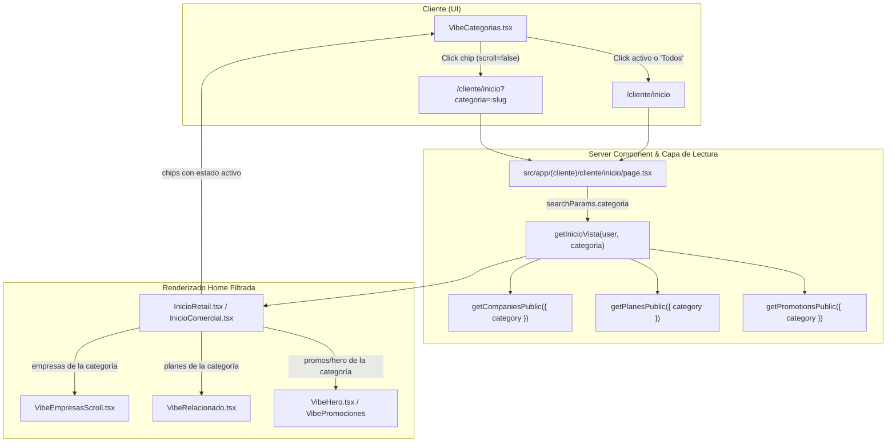

# Plan de Implementación: Filtrado de Categorías en Página Principal (`/cliente/inicio`)

> **For agentic workers:** REQUIRED SUB-SKILL: Use superpowers:subagent-driven-development to implement this plan task-by-task. Steps use checkbox (`- [ ]`) syntax for tracking.

**Goal:** Permitir que los chips de categorías en la página principal del cliente (`/cliente/inicio`) filtren el contenido del Inicio en tiempo real (empresas, planes, promociones y héroe) en lugar de navegar a `/cliente/explorar`, con soporte para alternar/limpiar el filtro y conservar una navegación fluida sin saltos de scroll.

**Architecture:** Se aprovecha el modelo de Server Components y URL search params (`/cliente/inicio?categoria=<slug>`) de Next.js App Router. Al hacer clic en un chip de categoría en [`VibeCategorias.tsx`](file:///C:/Users/Usuario/projects/MEMBEGO-worktrees/flujos-cliente-user-friendly/src/components/cliente/inicio/VibeCategorias.tsx), se navega con `scroll={false}` a la misma página con el parámetro de categoría. La función [`getInicioVista`](file:///C:/Users/Usuario/projects/MEMBEGO-worktrees/flujos-cliente-user-friendly/src/modules/home/lectura.ts) recibe este parámetro y filtra las consultas de marketplace (`getCompaniesPublic`, `getPlanesPublic`, `getPromotionsPublic`) a nivel de base de datos. Los chips reflejan el estado activo (anillo destacado y opacidad), hacer clic en la categoría activa o en "Todos" restablece el filtro, y los enlaces "Ver más" heredan la categoría seleccionada.

**Architecture Diagram:**



**Tech Stack:** Next.js App Router, React Server Components, Tailwind CSS, Prisma / PostgreSQL.

---

## Global Constraints
- No romper los contratos de [`tests/cliente-retail.test.ts`](file:///C:/Users/Usuario/projects/MEMBEGO-worktrees/flujos-cliente-user-friendly/tests/cliente-retail.test.ts) (conservar firmas `comercial: InicioVista`, `publicada?.tipos ?? TIPOS_BLOQUE`, `heroesPorDefecto`, `InicioComercial`).
- No alterar las clases del vocabulario de diseño fuera de las ya existentes ni introducir clases no soportadas por la auditoría de tema oscuro.
- Mantener la regla establecida en el paso anterior: "Todos" usa el primer gradiente ([`COLORES[0]`](file:///C:/Users/Usuario/projects/MEMBEGO-worktrees/flujos-cliente-user-friendly/src/components/cliente/inicio/VibeCategorias.tsx#L46)) y la primera categoría real inicia en el segundo gradiente ([`COLORES[1]`](file:///C:/Users/Usuario/projects/MEMBEGO-worktrees/flujos-cliente-user-friendly/src/components/cliente/inicio/VibeCategorias.tsx#L47)).

---

## User Review Required

> [!IMPORTANT]
> - **Comportamiento de toggle**: Si el usuario hace clic sobre la categoría que ya está activa, se desactiva y vuelve a mostrar "Todos" (`/cliente/inicio`).
> - **Navegación sin saltos (`scroll={false}`)**: Los enlaces de los chips llevan `scroll={false}` en Next.js para evitar que la pantalla salte al tope al cambiar de categoría.
> - **Manejo de categorías sin contenido**: Si una categoría no tiene empresas ni membresías publicadas, se mostrará un mensaje amigable indicando que no hay negocios disponibles aún en esa categoría con un botón directo para "Ver todas las categorías".

---

## Proposed Changes

### Componente de Datos y Lectura (`src/modules/home`)

#### [MODIFY] [`vista.ts`](file:///C:/Users/Usuario/projects/MEMBEGO-worktrees/flujos-cliente-user-friendly/src/modules/home/vista.ts)
- Agregar la propiedad opcional `readonly categoriaActiva?: string | null` en [`InicioVista`](file:///C:/Users/Usuario/projects/MEMBEGO-worktrees/flujos-cliente-user-friendly/src/modules/home/vista.ts#L157).

```diff
 export interface InicioVista {
   readonly revisionId: string | null
   readonly territorio: string | null
+  readonly categoriaActiva?: string | null
   readonly bloques: readonly TipoBloque[]
   readonly heroes: readonly HeroInicio[]
```

---

#### [MODIFY] [`lectura.ts`](file:///C:/Users/Usuario/projects/MEMBEGO-worktrees/flujos-cliente-user-friendly/src/modules/home/lectura.ts)
- Extender la firma de [`getInicioVista`](file:///C:/Users/Usuario/projects/MEMBEGO-worktrees/flujos-cliente-user-friendly/src/modules/home/lectura.ts#L148) para aceptar `categoriaSlug?: string`:
  `export async function getInicioVista(user: SessionUser, categoriaSlug?: string): Promise<InicioVista>`
- Filtrar llamadas cuando `categoriaSlug` esté presente:
  - `getCompaniesPublic({ category: categoriaSlug, limit: 10 })`
  - `getPlanesPublic({ category: categoriaSlug, limit: 20 })`
  - `getPromotionsPublic({ category: categoriaSlug, limit: 20 })`
  - En `empresasScroll`: Cuando hay categoría activa, asegurar que solo se muestren negocios que pertenezcan a la categoría filtrada.
  - En `poolPromos` / `heroesPorDefecto`: Alimentar con las promociones filtradas por la categoría.
  - En `experiencias`: Si la categoría no corresponde a turismo/tours/excursiones, resolver a lista vacía `[]`.
  - Devolver `categoriaActiva: categoriaSlug ?? null` en el objeto resultante de `InicioVista`.

---

### Ruta y Servidor (`src/app/(cliente)/cliente/inicio`)

#### [MODIFY] [`page.tsx`](file:///C:/Users/Usuario/projects/MEMBEGO-worktrees/flujos-cliente-user-friendly/src/app/(cliente)/cliente/inicio/page.tsx)
- Leer `searchParams` en `InicioCliente`:
  ```tsx
  export default async function InicioCliente({
    searchParams,
  }: {
    searchParams?: Promise<{ categoria?: string; category?: string }>
  }) {
    const user = await requireRole('CLIENTE')
    const params = await searchParams
    const categoria = typeof params?.categoria === 'string'
      ? params.categoria
      : typeof params?.category === 'string'
        ? params.category
        : undefined

    const [comercial, personal] = await Promise.all([
      getInicioVista(user, categoria),
      cargarPanelPersonal(user),
    ])
    return <InicioRetail comercial={comercial} personal={personal} />
  }
  ```

---

### Componentes de UI (`src/components/cliente/inicio`)

#### [MODIFY] [`VibeCategorias.tsx`](file:///C:/Users/Usuario/projects/MEMBEGO-worktrees/flujos-cliente-user-friendly/src/components/cliente/inicio/VibeCategorias.tsx)
- Recibir prop opcional `categoriaActiva?: string | null`.
- Cambiar el enlace de "Todos" de `/cliente/explorar` a `/cliente/inicio` con `scroll={false}`.
- Aplicar estilo activo en "Todos" cuando `!categoriaActiva` (anillo y borde resaltado), o estilo atenuado si hay una categoría activa.
- Para cada categoría:
  - Calcular si está activa: `const esActiva = categoriaActiva === c.slug`.
  - Enlace destino: `esActiva ? '/cliente/inicio' : `/cliente/inicio?categoria=${encodeURIComponent(c.slug)}`` con `scroll={false}`.
  - Si `esActiva`, aplicar anillo activo (`border-2 border-white ring-2 ring-white ring-offset-2 ring-offset-vibe-fondo shadow-md scale-105`) y opacidad completa; si no está activa, opacidad suave (`opacity-85 hover:opacity-100`).
- Si hay `categoriaActiva`, agregar un pequeño indicador debajo con el nombre de la categoría activa y un botón para limpiar el filtro ("Mostrar todas" con icono `X`).

---

#### [MODIFY] [`InicioComercial.tsx`](file:///C:/Users/Usuario/projects/MEMBEGO-worktrees/flujos-cliente-user-friendly/src/components/cliente/inicio/InicioComercial.tsx)
- Pasar `data.categoriaActiva` a `VibeCategorias`, `VibeEmpresasScroll` y `VibeRelacionado`.
- Si `data.categoriaActiva` está presente y las listas de empresas y planes están vacías, renderizar un estado vacío amigable con botón para remover el filtro y volver a ver todas las categorías.

---

#### [MODIFY] [`VibeHero.tsx`](file:///C:/Users/Usuario/projects/MEMBEGO-worktrees/flujos-cliente-user-friendly/src/components/cliente/inicio/VibeHero.tsx)
- Si `heroes.length === 0`, retornar `null` cuando esté filtrado para no desplazar el contenido relevante (empresas y membresías) con una caja vacía de novedades.

---

#### [MODIFY] [`VibeEmpresasScroll.tsx`](file:///C:/Users/Usuario/projects/MEMBEGO-worktrees/flujos-cliente-user-friendly/src/components/cliente/inicio/VibeEmpresasScroll.tsx) & [`VibeRelacionado.tsx`](file:///C:/Users/Usuario/projects/MEMBEGO-worktrees/flujos-cliente-user-friendly/src/components/cliente/inicio/VibeRelacionado.tsx)
- El enlace de "Ver más" de empresas pasa a `/cliente/explorar?category=${categoriaActiva}` si hay categoría activa.
- El enlace de "Ver más" de membresías pasa a `/cliente/planes?todos=1&categoria=${categoriaActiva}` si hay categoría activa.

---

## Plan de Tareas

### Tarea 1: Extender tipos y consulta de lectura (`vista.ts` & `lectura.ts`)
**Archivos:**
- Modificar: [`src/modules/home/vista.ts`](file:///C:/Users/Usuario/projects/MEMBEGO-worktrees/flujos-cliente-user-friendly/src/modules/home/vista.ts)
- Modificar: [`src/modules/home/lectura.ts`](file:///C:/Users/Usuario/projects/MEMBEGO-worktrees/flujos-cliente-user-friendly/src/modules/home/lectura.ts)
- Crear prueba: `tests/inicio-filtro-categorias.test.ts`

- [ ] **Paso 1: Escribir prueba que verifique que `getInicioVista` admite categoría y asigna `categoriaActiva`**
- [ ] **Paso 2: Ejecutar prueba y verificar que falla (campo o firma no existente)**
- [ ] **Paso 3: Implementar cambios en `vista.ts` y `lectura.ts`**
- [ ] **Paso 4: Ejecutar prueba y verificar que pasa**

### Tarea 2: Conectar `searchParams` en la página de inicio
**Archivos:**
- Modificar: [`src/app/(cliente)/cliente/inicio/page.tsx`](file:///C:/Users/Usuario/projects/MEMBEGO-worktrees/flujos-cliente-user-friendly/src/app/(cliente)/cliente/inicio/page.tsx)

- [ ] **Paso 1: Pasar `searchParams` a `getInicioVista` en `page.tsx`**
- [ ] **Paso 2: Ejecutar `npm run typecheck` para verificar compatibilidad de tipos en Next.js**

### Tarea 3: Actualizar `VibeCategorias.tsx` para filtrar en el Inicio
**Archivos:**
- Modificar: [`src/components/cliente/inicio/VibeCategorias.tsx`](file:///C:/Users/Usuario/projects/MEMBEGO-worktrees/flujos-cliente-user-friendly/src/components/cliente/inicio/VibeCategorias.tsx)
- Modificar: [`src/components/cliente/inicio/InicioComercial.tsx`](file:///C:/Users/Usuario/projects/MEMBEGO-worktrees/flujos-cliente-user-friendly/src/components/cliente/inicio/InicioComercial.tsx)

- [ ] **Paso 1: Agregar soporte a `categoriaActiva`, enlaces hacia `/cliente/inicio`, toggling y estado activo visual**
- [ ] **Paso 2: Pasar `categoriaActiva` desde `InicioComercial.tsx` y contemplar estado vacío si la categoría no tiene items**
- [ ] **Paso 3: Ajustar `VibeHero.tsx`, `VibeEmpresasScroll.tsx` y `VibeRelacionado.tsx` para enlaces contextuales**

### Tarea 4: Verificación y Pruebas
**Archivos:**
- Ejecutar: `tests/inicio-filtro-categorias.test.ts`
- Ejecutar: `npm run typecheck`

- [ ] **Paso 1: Ejecutar la nueva prueba unitaria con `npx tsx --test tests/inicio-filtro-categorias.test.ts`**
- [ ] **Paso 2: Ejecutar `npm run typecheck` y verificar que no haya errores de compilación**

---

## Verification Plan

### Automated Tests
1. Ejecutar prueba unitaria específica:
   ```bash
   npx tsx --test tests/inicio-filtro-categorias.test.ts
   ```
2. Ejecutar chequeo de tipos:
   ```bash
   npm run typecheck
   ```

### Manual Verification
1. Abrir `/cliente/inicio`.
2. Verificar que el botón "Todos" aparece seleccionado por defecto.
3. Hacer clic en una categoría (por ejemplo, "Lavado" o "Gastronomía").
4. Verificar que la URL pasa a `/cliente/inicio?categoria=<slug>` sin salto de scroll.
5. Verificar que el chip de la categoría seleccionada tiene el anillo/borde de selección activo y "Todos" queda atenuado.
6. Verificar que las empresas y membresías mostradas en la pantalla corresponden a esa categoría.
7. Hacer clic nuevamente en el chip activo o en "Todos" y confirmar que el filtro se desactiva y vuelven a aparecer todas las categorías.
