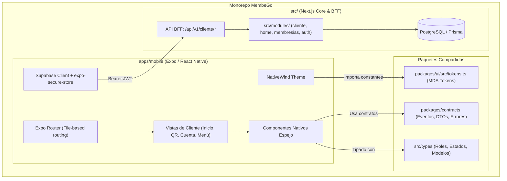

# Especificación de Diseño: App Móvil de Clientes en React Native (MembeGo)

- **Fecha:** 2026-09-11
- **Estado:** Propuesta / En revisión
- **Ubicación:** `apps/mobile`

---

## 1. Contexto y Objetivos

### 1.1 Problema y Necesidad
MembeGo cuenta actualmente con un portal web para clientes en Next.js (`src/app/(cliente)`), que incluye un diseño retail violeta moderno ("Stitch", aprobado en 2026-09-10). Para mejorar la retención, la inmediatez en el uso de membresías en puntos físicos de venta y la experiencia táctil, se requiere una **aplicación móvil nativa en React Native para clientes**.

### 1.2 Objetivos Clave
1. **Reutilización de Contratos y Modelos Tipados:** Aprovechar `@membego/contracts` y las definiciones de TypeScript de `@/types` (`MembershipEstado`, `InicioVista`, `PanelPersonal`, `ClienteRow`, etc.) sin duplicar código ni generar inconsistencias de esquemas.
2. **Fidelidad Visual y Tokens MDS:** Consumir los tokens de diseño de `packages/ui/src/tokens.ts` (escala primaria, degradados violeta Stitch, espaciados, radios y tipografía) mediante **NativeWind** (Tailwind para React Native).
3. **Cero Impacto en la Web Existente:** Mantener el código web de producción intacto mediante una arquitectura monorepo en `apps/mobile`.
4. **Seguridad y Aislamiento:** La app móvil interactúa a través de una capa API BFF (Backend-For-Frontend) en Next.js con autenticación Supabase JWT protegida en el enclave seguro (`expo-secure-store`).

---

## 2. Arquitectura del Sistema



---

## 3. Estructura de Directorios (`apps/mobile`)

```text
apps/mobile/
├── app/                                # Expo Router (Navegación basada en archivos)
│   ├── _layout.tsx                     # Providers globales (QueryClient, AuthContext, Theme)
│   ├── (auth)/
│   │   ├── _layout.tsx
│   │   ├── login.tsx                   # Pantalla de Login con Supabase
│   │   └── recuperar.tsx               # Recuperación de contraseña
│   ├── (tabs)/                         # 4 Destinos Canónicos (Stitch S01)
│   │   ├── _layout.tsx                 # Tab Navigator con Dock Inferior estilizado
│   │   ├── inicio.tsx                  # Pantalla Inicio Retail (Hero, Categorías, Ofertas)
│   │   ├── qr.tsx                      # Mi QR dinámico y selector de membresías
│   │   ├── cuenta.tsx                  # Perfil, Vehículos, Historial de visitas y Pagos
│   │   └── menu.tsx                    # Directorio de exploración, categorías y soporte
│   ├── buscar.tsx                      # Modal de búsqueda unificada en tiempo real
│   ├── cerca.tsx                       # Mapa interactivo y negocios cercanos
│   └── membresia/
│       └── [id].tsx                    # Vista detallada de contrato o membresía
├── src/
│   ├── components/                     # Componentes nativos cliente (espejo de web)
│   │   ├── layout/
│   │   │   ├── HeaderVibe.tsx          # Cabecera con degradado violeta + buscador
│   │   │   ├── PillUbicacion.tsx       # Barra de ubicación "Explorar cerca de ti"
│   │   │   └── BottomTabDock.tsx       # Dock inferior con tabs de 44px táctiles
│   │   ├── inicio/
│   │   │   ├── VibeHeroNative.tsx      # Carrusel de promociones y destacados
│   │   │   ├── VibeCategoriasNative.tsx# Chips de categorías con scroll horizontal
│   │   │   ├── VibeRelampagoNative.tsx # Ofertas relámpago con cuenta regresiva
│   │   │   ├── VibeRelacionadoNative.tsx# Membresías recomendadas
│   │   │   └── VibeReferidosNative.tsx # Banner "Invita y Gana" con Share nativo
│   │   ├── qr/
│   │   │   ├── QrCodeCard.tsx          # Renderizado de QR con react-native-qrcode-svg
│   │   │   └── MembershipBadge.tsx     # Estado de membresía (Activa, Vencida, etc.)
│   │   └── ui/                         # Primitivas UI nativas (Button, Card, Badge, Skeleton)
│   ├── lib/
│   │   ├── api.ts                      # Cliente HTTP (fetch con Bearer JWT automático)
│   │   ├── supabase.ts                 # Cliente Supabase con adaptador SecureStore
│   │   └── auth-context.tsx            # Contexto de sesión de usuario cliente
│   ├── hooks/                          # React Query hooks (useInicio, useQr, usePerfil)
│   └── theme/
│       └── tokens.ts                   # Re-export de tokens MDS adaptados a NativeWind
├── assets/                             # Logos, iconos SVG/PNG, fuentes Geist/PlusJakarta
├── app.json                            # Metadatos de Expo (bundleIdentifier, permissions)
├── babel.config.js
├── metro.config.js                     # Configuración monorepo (watchFolders a packages/)
├── package.json
├── tailwind.config.js                  # Configuración NativeWind consumiendo tokens MDS
└── tsconfig.json                       # Configuración TypeScript apuntando a root types
```

---

## 4. Sistema de Diseño y Tokens (MDS Móvil)

### 4.1 Vinculación de Tokens
La app móvil importa directamente los tokens definidos en `packages/ui/src/tokens.ts`:
- **Marca Primaria:** `primary[500]` (`#0084ff`), `primary[600]` (`#006bed`), etc.
- **Degradados Stitch Violeta:**
  - Header: `['#5b21b6', '#7c3aed', '#2563eb', '#06b6d4']`
  - Botones Vibe: `['#7c3aed', '#2563eb', '#06b6d4']`
- **Estados Semánticos:** `state.success` (`#00864d`), `state.warning` (`#ab6300`), `state.danger` (`#e7000b`).
- **Radios y Espaciados:** `radius['2xl']` (20px), `radius.lg` (12px), `spacing` basado en múltiplos de 4px.
- **Áreas Táctiles:** Mínimo de 44x44px en botones e iconos interactivos según la directriz `minTouchTarget` de MDS.

---

## 5. Navegación y Pantallas del Cliente (Stitch S01–S04)

### 5.1 Tab 1: Inicio Retail (`(tabs)/inicio.tsx`)
- **Cabecera:** `HeaderVibe` con input de búsqueda (navega a `/buscar`), botón de acceso directo a `/qr`, campana de notificaciones y avatar con iniciales.
- **Barra de Ubicación:** `PillUbicacion` con detección opcional de GPS vía `expo-location` o selección de zona/sector manual.
- **Bloques Modulares (espejo de `InicioComercial.tsx`):**
  1. `VibeHeroNative`: Carrusel con `FlatList` optimizado para móvil con paginación visual.
  2. `VibeCategoriasNative`: Chips interactivos con haptic feedback (`expo-haptics`).
  3. `VibeRelampagoNative`: Ofertas con temporizador en vivo.
  4. `VibeRelacionadoNative`: Planes destacados.
  5. `VibeReferidosNative`: Enlace de referidos con acción de compartir nativa (`Share.share`).
- **Pull to Refresh:** Soporte nativo para refrescar datos con `RefreshControl`.

### 5.2 Tab 2: Mi QR y Membresías (`(tabs)/qr.tsx`)
- Generación de código QR seguro mediante `react-native-qrcode-svg`.
- Brillo de pantalla automático (`expo-brightness`) al visualizar el carnet para facilitar la lectura por escáneres en comercios.
- Selector de membresía si el usuario posee múltiples suscripciones activas.
- Indicador de estado claro (`Activa`, `En riesgo`, `Vencida`).

### 5.3 Tab 3: Cuenta y Perfil (`(tabs)/cuenta.tsx`)
- Datos personales (nombre, email, teléfono, foto de perfil).
- Gestión de vehículos registrados (placas, modelos).
- Historial reciente de visitas y canjes en negocios.
- Historial de pagos y facturas.

### 5.4 Tab 4: Menú (`(tabs)/menu.tsx`)
- Exploración de empresas y categorías completas.
- Soporte y ayuda (FAQ, contacto por WhatsApp nativo con `Linking.openURL`).
- Botón de cerrar sesión seguro.

---

## 6. Capa API BFF en Next.js (`src/app/api/v1/cliente/*`)

Para que la app móvil funcione sin conexión directa a PostgreSQL, Next.js expone endpoints tipados que reusan los módulos existentes del servidor:

| Endpoint | Método | Módulo / Servicio Reutilizado | Tipo de Retorno |
| :--- | :--- | :--- | :--- |
| `/api/v1/cliente/inicio` | `GET` | `getInicioVista(user)` + `cargarPanelPersonal(user)` | `{ comercial: InicioVista, personal: PanelPersonal }` |
| `/api/v1/cliente/qr` | `GET` | `getClientePerfil()` + `obtenerQrCliente()` | `{ qrPayload: string, memberships: Array<...> }` |
| `/api/v1/cliente/perfil` | `GET` | `getClientePerfil()` + `LocationService` | `{ perfil: ClientePerfil, vehiculos: Vehiculo[] }` |
| `/api/v1/cliente/menu` | `GET` | `getCategoriesPublic()` + `getNavOcultoClienteCached()`| `{ categorias: Categoria[], filas: FilaNav[] }` |
| `/api/v1/cliente/buscar` | `GET` | `buscarUnificado(query)` | `{ resultados: ResultadoBusqueda[] }` |

### 6.1 Middleware / Guard de Autenticación de API
```typescript
const authHeader = req.headers.get('Authorization')
const token = authHeader?.replace('Bearer ', '')
const { data: { user }, error } = await supabase.auth.getUser(token)

if (error || !user || user.user_metadata?.role !== 'CLIENTE') {
  return NextResponse.json({ error: 'No autorizado' }, { status: 401 })
}
```

---

## 7. Plan de Verificación y Calidad

### 7.1 Pruebas Automatizadas
1. **Typecheck de TypeScript:** `npm run typecheck` verifica que `apps/mobile` compile sin errores de tipos contra `@membego/contracts` y `@/types`.
2. **Pruebas Unitarias de Endpoints BFF:** Tests en `tests/api-mobile-cliente.test.ts` asegurando códigos 200 con payload correcto y 401 para usuarios sin sesión o con rol distinto a `CLIENTE`.
3. **Pruebas de Componentes Nativos:** Validación con `@testing-library/react-native` para renderizado de componentes clave (`HeaderVibe`, `QrCodeCard`).

### 7.2 Verificación Manual
1. Iniciar servidor Expo con `npx expo start` en `apps/mobile`.
2. Probar en dispositivo físico (iOS y Android mediante Expo Go / Development Build).
3. Validar inicio de sesión, renderizado del Inicio Retail, generación del QR dinámico y navegación por las 4 pestañas.
4. Probar funcionamiento offline / reconexión y estados de carga (shimmer skeletons).
